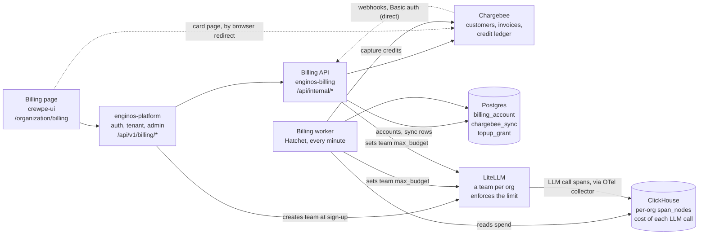

# Billing User Flows

Each section is one thing a person does. It shows what they do, what they see, what happens behind the scenes step by step — with the API each step calls — and what gets saved.

**Who's who.** *Page* = the billing page in the app (crewpe-ui). *Platform* = enginos-platform: checks the login, passes the request on. *Billing* = enginos-billing: does the work. *Chargebee* = the payment system. *LiteLLM* = the AI gateway that enforces each org's spending limit.

**Money in one line.** ₹1 buys 50 credits, and 50 credits = $1 of AI usage.

| Action | Started by | Result |
| --- | --- | --- |
| [1. Sign up](#1-sign-up) | New user | Chargebee customer; the free plan only for an org it is for |
| [2. Open the Billing page](#2-open-the-billing-page) | Admin | Balance, plan, card, payments |
| [3. Buy credits — first time](#3-buy-credits-for-the-first-time) | Admin | Card saved, card charged, credits added |
| [4. Buy credits — card saved](#4-buy-credits-with-a-saved-card) | Admin | Card charged, credits added |
| [5. Card is declined](#5-the-card-is-declined) | — | No credits; Chargebee retries in 24 h |
| [6. Pay now](#6-pay-now) | Admin | The unpaid top-up is paid, credits added |
| [7. Change the card](#7-change-or-remove-the-card) | Admin | New card saved in Chargebee |
| [8. See older payments](#8-see-older-payments) | Admin | 10 payments a page |
| [9. Download an invoice](#9-download-an-invoice) | Admin | The invoice PDF opens |
| [10. Use AI features](#10-use-ai-features) | Anyone in the org | Credits taken every minute |
| [11. Credits run out](#11-credits-run-out) | Automatic | AI requests stop until a top-up |
| [12. Yearly renewal](#12-the-plan-renews-each-year) | Automatic | New dates; no new free credits, unused ones kept |

---

## 1. Sign up

The whole sign-up, across every system, is in [SIGNUP-FLOW.md](SIGNUP-FLOW.md). This is billing's part.

**The user does.** Creates a new organization.

**The user sees.** Nothing about billing yet. Later, the Billing page shows either the free plan with 1,000 credits and a renewal date a year away, or — for an org the free plan is not for (the default, `FREE_PLAN_DEFAULT=false`) — **Choose a plan**, and AI requests are refused until one is bought.

**Behind the scenes**

1. The platform creates the organization: its record, database and login.
2. The platform creates the org's team in the AI gateway, with a spending limit of $0 for now. `LiteLLM POST /team/new`
3. The platform asks billing to set up the org, with the admin's email. `POST /api/internal/provision {tenantId, adminEmail}`
4. Billing creates the org as a customer in Chargebee — for every org; the customer id is the org id and the admin's email is the billing contact. `Chargebee POST /customers`

   The org's own setting (`billing_account.free_plan`), or `FREE_PLAN_DEFAULT`, decides whether the free plan is for it. If not, billing stops here; steps 5–9 run only when it is.
5. Billing checks the free plan really costs ₹0. `Chargebee GET /item_prices/{id}`
6. Billing subscribes the org to the free plan — no card needed. `Chargebee POST /customers/{id}/subscription_for_items`

   The plan itself gives no credits: its own credit grant is set to zero, because Chargebee would hand a plan's grant out again every year. So on its own the org would have no credit wallet in Chargebee at all.
7. Billing links the subscription and gives the org its free credits — 1,000 in all (`FREE_PLAN_CREDITS`), **once per org, ever**. They go into the `token-test` credit unit (`FREE_PLAN_CREDIT_UNIT`), which creates the org's credit wallet, and they are kept for 10 years. If the plan already gave some (orgs from before the change), only the rest is added. `Chargebee GET /subscriptions`, `GET /grant_blocks`, `POST /ledger_operations/allocate`
8. Billing records the new wallet as the org's, so usage is taken from it. If there is still no wallet, it repeats steps 7–8 every second for up to 10 seconds; normally once is enough. `Chargebee GET /ledger_account_balances`
9. Billing sets the AI spending limit to today's spend + $20 (1,000 credits × $0.02). `LiteLLM POST /team/update`

**Saved**

- Billing: one `billing_account` row — the org, its Chargebee customer and subscription, its credit unit, the plan's dates, status *active*, and the point from which usage is billed. One `topup_grant` row (`free-plan-credits`), so the free credits are never given twice.
- Chargebee: the customer, the free-plan subscription and the 1,000 credits.
- LiteLLM: the team's spending limit.

**If something goes wrong.** Sign-up still finishes. The Billing page then shows *Setting up your free plan* with a **Check again** button, and opening the page runs steps 4–9 again. If Chargebee refuses the free credits, the page shows *Activating*, AI requests wait, and billing tries again every minute — it can never give them twice.

**Seen live (Sep 30, 2026).** An org created on the zero-credit plan (`org_aaa_com`) had no wallet and no credits. Once this was in place, billing added 1,000 credits, the wallet appeared, and the org used it.

---

## 2. Open the Billing page

**The user does.** Goes to Organization → Billing. Only admins can open it.

**The user sees.** The credit balance (granted, used, left, last synced), the plan and its renewal date, the card on file, the top-up choices (₹50, ₹100, Custom), the payment history, and a warning if a top-up is still unpaid.

**Behind the scenes**

1. The page asks the platform for the billing details. `GET /billing`
2. The platform checks the login and the admin role, adds the org id, and asks billing. `GET /api/internal/billing/:tenantId`
3. Billing finds the org's row. If the org has no plan yet and the free plan is for it, it starts the free plan first (steps 4–9 of *Sign up*); an org it is not for is shown the paid plans instead.
4. Billing reads the credit balance and the credits granted from Chargebee. `GET /ledger_account_balances`, `GET /grant_blocks`
5. Billing reads the plan and the card. `GET /subscriptions/{id}`, `GET /payment_sources`
6. Billing reads the 10 newest payments. `GET /transactions`
7. Billing reads the top-up price and any unpaid top-ups. `GET /item_prices/{id}`, `GET /invoices`
8. Billing reads when usage was last billed from its own database (`chargebee_sync`).

**Saved.** Nothing — every figure is read live from Chargebee each time.

**If something goes wrong.** Each part fails on its own: for example the payments table says it could not load, while the balance still shows. While the status is *Activating*, the page reloads itself every 30 seconds.

---

## 3. Buy credits for the first time

**The user does.** Picks an amount — ₹50, ₹100 or Custom. With no card saved, the button reads **Add card to pay ₹50.00**. They click it, enter the card on Chargebee's secure page, and come back. A confirm box is already open: *Charge ₹50.00 to Visa card ending 1111 for 2,500 credits? It is charged immediately.* They click **Confirm payment**.

**The user sees.** *Payment received — your credits have been added.* The balance goes up by 2,500.

**Behind the scenes**

1. The page remembers the amount picked, in the browser, for 30 minutes (`sessionStorage`).
2. The page asks for Chargebee's card page. `POST /billing/payment-method` → `POST /api/internal/payment-method`
3. Billing asks Chargebee for a card page that sends the browser back to the Billing page afterwards. `Chargebee POST /hosted_pages/manage_payment_sources`
4. The browser goes to Chargebee. The user enters the card there; Chargebee saves it.
5. Chargebee sends the browser back to `/organization/billing`. The page reloads, sees the new card and the remembered amount, and opens the confirm box.
6. From **Confirm payment** on, it is the same as [4. Buy credits with a saved card](#4-buy-credits-with-a-saved-card).

**Saved.** Chargebee: the card. Our side never sees or stores the card number.

**If something goes wrong.** If the user leaves Chargebee's page without adding a card, the amount is kept but no confirm box opens.

---

## 4. Buy credits with a saved card

**The user does.** Picks ₹50, ₹100 or Custom, clicks **Pay ₹50.00**, then **Confirm payment** in the box that asks *Charge ₹50.00 to Visa card ending 1111 for 2,500 credits?*

**The user sees.** *Payment received — your credits have been added.* The balance goes up, and the payment appears in the history.

**Behind the scenes**

1. The page turns the amount into units at ₹1 each and sends it. `POST /billing/topup {quantity: 50}` → `POST /api/internal/topup`
2. Billing checks the amount (1 to 100,000 units) and that the org has a live plan.
3. Billing checks no earlier top-up is still unpaid. `Chargebee GET /invoices`
4. Billing checks there is a card that can be charged. `Chargebee GET /payment_sources`
5. Billing asks Chargebee to charge the card now — sent once, never retried. `Chargebee POST /invoices/create_for_charge_items_and_charges` (with `auto_collection=on`)
6. Chargebee charges the card, marks the invoice paid, and gives 50 credits per unit. These credits never expire.
7. Billing waits up to 5 seconds for those credits to appear, then records the top-up. `Chargebee GET /grant_blocks`
8. Billing raises the AI spending limit by $1 per unit. `LiteLLM POST /team/update`
9. Billing answers the page with the paid invoice; the page reloads.

**Saved**

- Billing: one `topup_grant` row — the invoice, the credits, and a mark that they were granted, so they are never added twice.
- Chargebee: the paid invoice, the payment, and the credits.
- LiteLLM: the higher spending limit.

**If something goes wrong**

| The user sees | Why | Charged? |
| --- | --- | --- |
| *Payment failed — the card on file could not be charged* | Chargebee refused the card outright | No |
| *Your card was declined, so no credits were added* | Chargebee created the invoice but could not collect | Not yet — see [5](#5-the-card-is-declined) |
| *Add a card before buying credits* | No card that can be charged | No |
| *Pay the unpaid top-up before buying more credits* | An earlier top-up is still unpaid | No |
| *The top-up did not complete — reload in a minute before trying again* | No answer from Chargebee in time | Maybe — reloading shows it |

If the user closes the tab after paying, Chargebee's *payment succeeded* message to billing still adds the credits.

---

## 5. The card is declined

**The user does.** Clicks **Confirm payment**, but the card has, say, insufficient funds.

**The user sees.** *Your card was declined, so no credits were added. We will try the card again on Sep 29, 2026 — or update your card and pay now.* A banner stays on the page: *Top-up of ₹50.00 not paid*, with a **Pay ₹50.00 now** button. The buy button is disabled until it is paid.

**Behind the scenes**

1. Billing asks Chargebee to charge the card, as in [4](#4-buy-credits-with-a-saved-card). `Chargebee POST /invoices/create_for_charge_items_and_charges`
2. The card is declined. Chargebee still answers OK, with the invoice marked *payment due* and a failed payment recorded.
3. Chargebee creates the credits anyway, with the invoice. Billing holds them back: they are left out of the balance the page shows and out of the AI spending limit. `Chargebee GET /invoices`, `GET /grant_blocks`
4. Chargebee schedules a retry 24 hours later, on whatever card is saved at that time.

**Saved.** Chargebee: the unpaid invoice, the failed payment and the held-back credits. Billing: nothing until it is paid.

**How it gets paid**

| Way | When | Then |
| --- | --- | --- |
| **Pay now** | Whenever the user clicks it | Charged at once; credits added (see [6](#6-pay-now)) |
| Chargebee's retry | 24 h after the failure | Chargebee tells billing; credits added |
| Changing the card | — | Does **not** pay it by itself |

Only one top-up can be unpaid at a time, so a retry never charges for several.

---

## 6. Pay now

**The user does.** If the card has changed, updates it first (see [7](#7-change-or-remove-the-card)). Then clicks **Pay ₹50.00 now** on the unpaid banner.

**The user sees.** *Payment received — your credits have been added.* The banner goes away and buying is enabled again.

**Behind the scenes**

1. The page asks to pay what is owed. `POST /billing/topup/pay-unpaid` → `POST /api/internal/topup/pay-unpaid`
2. Billing finds the unpaid top-ups and checks there is a card. `Chargebee GET /invoices`, `GET /payment_sources`
3. Billing asks Chargebee to charge each one now, oldest first — sent once, never retried. `Chargebee POST /invoices/{id}/collect_payment`
4. Paid: billing records the top-up and raises the AI spending limit, as in steps 7–8 of [4](#4-buy-credits-with-a-saved-card).

**Saved.** The same invoice becomes paid — no new invoice. The history shows two rows for it: the failed attempt and the successful one. Billing adds its `topup_grant` row.

**If something goes wrong.** Declined again: *Payment failed — the card on file could not be charged*, and it stays unpaid. No card: *Add a card before buying credits*.

---

## 7. Change or remove the card

**The user does.** Under *Payment method*, clicks **Update card** (or **Add card**), makes the change on Chargebee's page, and comes back.

**The user sees.** The new card under *Payment method*, e.g. *Visa •••• 1111*.

**Behind the scenes**

1. The page asks for Chargebee's card page. `POST /billing/payment-method` → `POST /api/internal/payment-method`
2. Billing gets the page from Chargebee. `Chargebee POST /hosted_pages/manage_payment_sources`
3. The browser goes to Chargebee; the user adds, replaces or removes a card.
4. Chargebee sends the browser back to the Billing page, which shows the new card. `Chargebee GET /payment_sources`

**Saved.** Only in Chargebee: the card, as the one used for future charges. Our side never sees or stores card numbers.

**Good to know.** Changing the card does not pay an unpaid top-up — use **Pay now**.

---

## 8. See older payments

**The user does.** In *Payments*, clicks **Next** or **Previous**.

**The user sees.** 10 payments a page, newest first: date, type, card, amount, status and an invoice download. Each row is one payment attempt, so a declined attempt and its later payment on the same invoice are two rows.

**Behind the scenes**

1. The first page comes with the Billing page itself.
2. **Next** asks for the page after the last one shown. `GET /billing/payments?offset=…` → `GET /api/internal/billing/:tenantId/payments`
3. Billing reads that page from Chargebee. `Chargebee GET /transactions`
4. **Previous** shows a page already loaded — no call.

**Saved.** Nothing.

---

## 9. Download an invoice

**The user does.** Clicks the download icon on a payment.

**The user sees.** The invoice PDF opens in a new tab.

**Behind the scenes**

1. The page asks for the invoice. `GET /billing/invoices/:id` → `GET /api/internal/billing/:tenantId/invoice/:invoiceId`
2. Billing checks the invoice belongs to this org. `Chargebee GET /invoices/{id}`
3. Billing asks Chargebee for a download link that works for a short time. `Chargebee POST /invoices/{id}/pdf`
4. The page opens the link — in this tab if the browser blocks pop-ups.

**Saved.** Nothing.

**If something goes wrong.** Another org's invoice, or one that does not exist, gives the same *not found*.

---

## 10. Use AI features

**The user does.** Anyone in the org uses agents, chat or anything else that calls an AI model.

**The user sees.** On the Billing page, *Used* goes up and *Last synced* updates — about 1–2 minutes after the call ends.

**Behind the scenes**

1. Every AI call goes through LiteLLM. Its gate refuses an org with no plan, or one billing has blocked because its credits are used up.
2. The cost of each call is written to ClickHouse, in the org's own table (`tenant_<slug>.span_nodes`), usually well under a minute after the call ends.
3. Every minute, billing's background worker adds up the cost of each org's calls that **ended** since it last looked, up to 60 seconds ago (`BILLING_LAG_MS`; 45 seconds on a developer machine) — the wait lets every call's cost arrive first. A call counts by when it finished, not when it started. After an outage it catches up an hour at a time (`BILLING_MAX_RANGE_MS`). `ClickHouse SELECT … FROM tenant_<slug>.span_nodes`
4. It turns dollars into credits: $1 = 50 credits.
5. It takes those credits from the org's Chargebee balance. Each stretch of time — normally a minute, at most an hour — is sent with its own id, so it can never be taken twice. `Chargebee POST /ledger_operations/capture`
6. It moves its "billed up to here" marker forward.

**Saved**

- Billing: one `chargebee_sync` row for each stretch that had usage — the dollars, the credits, the number of calls and whether Chargebee took them. The marker on `billing_account`.
- Chargebee: the credits taken.

**If something goes wrong.** Chargebee down or slow: the same stretch is retried until it goes through, and the marker waits — nothing is lost or billed twice. Problems that need a person are alerted in Sentry.

---

## 11. Credits run out

**The user does.** Nothing — it happens as they use AI features.

**The user sees.** AI requests start failing. The Billing page shows the status *Exhausted*: *Credits are exhausted. New LLM requests are being refused until the balance is topped up or the term renews.*

**Behind the scenes**

1. LiteLLM refuses new calls once the org's spend reaches its limit.
2. Billing's next attempt to take credits fails: Chargebee says there is not enough balance. That minute is kept as *out of credits*.
3. Billing marks the org *exhausted* and blocks its LiteLLM team. `LiteLLM POST /team/update {blocked: true}`
4. After a top-up ([4](#4-buy-credits-with-a-saved-card) or [6](#6-pay-now)), billing unblocks the team, marks the org *active*, and bills the minutes that were waiting. Credits someone adds by hand in Chargebee's dashboard do the same within seconds: Chargebee tells billing credits were added (the *grant blocks created* message), and billing reads the org again. `Chargebee GET /subscriptions`, `GET /grant_blocks`; `LiteLLM POST /team/update`

**Saved.** Billing: status *exhausted* on `billing_account`, and the waiting minute in `chargebee_sync`. LiteLLM: the team blocked, with the reason.

---

## 12. The plan renews each year

**The user does.** Nothing. It happens on the renewal date shown on the Billing page.

**The user sees.** A new renewal date a year later. No new free credits: the free plan's 1,000 were given once, at sign-up. Credits not used yet are still there.

**Behind the scenes**

1. Chargebee renews the ₹0 plan. It adds no credits, because the plan's own credit grant is set to zero.
2. Chargebee tells billing the plan renewed (the *subscription renewed* webhook). billing `POST /api/webhooks/chargebee`, directly
3. Billing reads the subscription again and stores the new dates. `Chargebee GET /subscriptions`
4. Billing does **not** give the free credits again — its `topup_grant` row says they were given.
5. Billing resets the AI spending limit so it matches the credits left. `LiteLLM POST /team/update`
6. Once a day, billing also re-reads every org's plan, in case a Chargebee message was missed.

**Saved.** Billing: the new term dates on `billing_account`. LiteLLM: the new limit.

**Not yet seen live.** No test org has renewed yet; the first renewal on the test site is due on Oct 25, 2026.

---

## How the parts connect

The browser only ever talks to the platform — except for Chargebee's card page, which it visits directly. The platform checks the login and passes requests to billing, and only billing talks to Chargebee and sets the AI spending limit.

**Chargebee's messages** (webhooks) go straight to billing — the one address of billing open to the internet, `https://app.enwithai.com/api/webhooks/chargebee`. Neither the app nor the platform is in between. Billing checks the username and password Chargebee sends with each one (set in billing's own settings, `CHARGEBEE_WEBHOOK_USER` / `CHARGEBEE_WEBHOOK_PASSWORD`); a wrong or missing pair is refused, and if billing has none set it refuses every message. Billing acts on these:

| Message from Chargebee | What billing does |
| --- | --- |
| A plan was created, changed, renewed, cancelled… | Reads the org's plan again from Chargebee |
| A payment went through | Adds a paid top-up's credits (only for top-up invoices) |
| Credits were added (*grant blocks created*) | Reads the org again, so its AI spending limit rises within seconds — also for credits added by hand in Chargebee |
| A payment failed | Notes it; Chargebee retries the card itself |
| Chargebee's **Test Webhook** button | Answers OK and does nothing — it is sample data (a made-up customer, `cbdemo_tom`) |

Any other message is answered OK and ignored. If billing fails on one, it says so, and Chargebee sends it again later.

---

## What is saved where

Billing keeps three small tables of ids and progress. Every amount of money and every credit lives in Chargebee, and card numbers are never stored on our side.

| Where | What | Written in |
| --- | --- | --- |
| Billing — `billing_account` | One row per org: its Chargebee customer and plan, credit unit, plan dates, status, and "usage billed up to here" | 1, 10, 11, 12 |
| Billing — `chargebee_sync` | One row per minute with AI usage: dollars, credits, calls, and whether Chargebee took them | 10, 11 |
| Billing — `topup_grant` | One row per paid top-up, and one for an org's free credits, so none are ever added twice | 1, 4, 6 |
| Chargebee | The customer, the plan, invoices, payments, cards, and the credits | 1, 3–7, 10, 12 |
| LiteLLM | Each org's spending limit, and whether it is blocked | 1, 4, 6, 11, 12 |
| ClickHouse | The cost of every AI call, per org — billing only reads it | 10 |
| The browser | The amount picked before going to Chargebee's card page, for 30 minutes | 3 |
