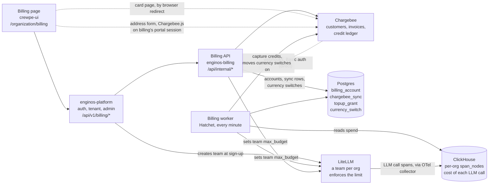

# Billing User Flows

Each section is one thing a person does. It shows what they do, what they see, what happens behind the scenes step by step — with the API each step calls — and what gets saved.

**Who's who.** *Page* = the billing page in the app (crewpe-ui). *Platform* = enginos-platform: checks the login, passes the request on. *Billing* = enginos-billing: does the work. *Chargebee* = the payment system. *LiteLLM* = the AI gateway that enforces each org's spending limit.

**Money in one line, per currency.** 50 credits = $1 of AI usage, whatever money bought them (`CREDITS_PER_USD`). The billing address decides the money: an org in India pays in INR, every other org in USD, and an org with no address yet is on USD.

| Currency | Who | A top-up | Credits it buys |
| --- | --- | --- | --- |
| INR | Billing country India | `api_token-INR` (`TOPUP_ITEM_PRICE_ID_INR`), ₹1 a unit | 50 a unit — measured |
| USD | Every other country, and no address yet | `api_token-USD` (`TOPUP_ITEM_PRICE_ID_USD`) | What the pack's Credit Grant in Chargebee gives — not measured yet |

| Action | Started by | Result |
| --- | --- | --- |
| [1. Sign up](#1-sign-up) | New user | Chargebee customer; the free plan, in USD, only for an org it is for |
| [2. Open the Billing page](#2-open-the-billing-page) | Admin | Balance, billing address, plan, card, payments |
| [3. Add the billing address](#3-add-the-billing-address) | Admin | Address saved in Chargebee; its country decides the currency |
| [4. Billing currency changes](#4-billing-currency-changes) | Automatic, after 3 | A free plan moved to the new currency, credits and usage carried over |
| [5. Buy credits — first time](#5-buy-credits-for-the-first-time) | Admin | Card saved, card charged, credits added |
| [6. Buy credits — card saved](#6-buy-credits-with-a-saved-card) | Admin | Card charged, credits added |
| [7. Card is declined](#7-the-card-is-declined) | — | No credits; Chargebee retries in 24 h |
| [8. Pay now](#8-pay-now) | Admin | The unpaid top-up is paid, credits added |
| [9. Change the card](#9-change-or-remove-the-card) | Admin | New card saved in Chargebee |
| [10. See older payments](#10-see-older-payments) | Admin | 10 payments a page |
| [11. Download an invoice](#11-download-an-invoice) | Admin | The invoice PDF opens |
| [12. Use AI features](#12-use-ai-features) | Anyone in the org | Credits taken every minute |
| [13. Credits run out](#13-credits-run-out) | Automatic | AI requests stop until a top-up |
| [14. Yearly renewal](#14-the-plan-renews-each-year) | Automatic | New dates; no new free credits, unused ones kept |

---

## 1. Sign up

The whole sign-up, across every system, is in [SIGNUP-FLOW.md](SIGNUP-FLOW.md). This is billing's part.

**The user does.** Creates a new organization.

**The user sees.** Nothing about billing yet. Later, the Billing page shows either the free plan with 1,000 credits and a renewal date a year away, or — for an org the free plan is not for (the default, `FREE_PLAN_DEFAULT=false`) — **Choose a plan**, and AI requests are refused until one is bought.

**Behind the scenes**

1. The platform creates the organization: its record, database and login.
2. The platform creates the org's team in the AI gateway, with a spending limit of $0 for now. `LiteLLM POST /team/new`
3. The platform asks billing to set up the org, with the admin's email. `POST /api/internal/provision {tenantId, adminEmail}`
4. Billing creates the org as a customer in Chargebee — for every org; the customer id is the org id and the admin's email is the billing contact. `Chargebee POST /customers`

   The org's own setting (`billing_account.free_plan`), or `FREE_PLAN_DEFAULT`, decides whether the free plan is for it. If not, billing stops here; steps 5–10 run only when it is.
5. Billing picks the free plan of the org's currency. A new org has no billing address, so that is USD (`BILLING_DEFAULT_CURRENCY`): `FREE_PLAN_ITEM_PRICE_ID_USD`. It checks the plan really costs nothing, and is priced in USD. `Chargebee GET /subscriptions`, `GET /item_prices/{id}`
6. Billing subscribes the org to the free plan — no card needed. `Chargebee POST /customers/{id}/subscription_for_items` (key `free-plan:<org id>:USD`)

   The plan gives next to nothing itself: its own credit grant is cut to zero or a single credit (MEASURED: a new subscription on the USD or the INR free plan gets 1), because Chargebee would hand a plan's grant out again every year.
7. Billing links the subscription and gives the org its free credits — 1,000 in all (`FREE_PLAN_CREDITS`), less what the plan gave, **once per org, ever**. They go into the `token-test` credit unit (`FREE_PLAN_CREDIT_UNIT`), which creates the org's credit wallet if the plan made none, and they are kept for 10 years. `Chargebee GET /subscriptions`, `GET /grant_blocks`, `POST /ledger_operations/allocate`

   With `FREE_PLAN_CREDITS` empty or `0` there are no free credits: the org has what the plan itself gave, and a plan that gave nothing is still linked, to `FREE_PLAN_CREDIT_UNIT`, with 0 credits.
8. Billing records the wallet as the org's, so usage is taken from it. If there is still no wallet, it repeats steps 7–8 every second for up to 10 seconds; normally once is enough. `Chargebee GET /ledger_account_balances`
9. Billing sets the AI spending limit to today's spend + $20 (1,000 credits × $0.02). `LiteLLM GET /team/info`, `POST /team/update`
10. Billing tells Chargebee the customer pays in USD, so its payments go through the USD gateway. A failure is logged and changes nothing else. `Chargebee POST /customers/{id}` (`preferred_currency_code=USD`)

**Saved**

- Billing: one `billing_account` row — the org, its Chargebee customer and subscription, the subscription's currency (`USD`), its credit unit, the plan's dates, status *active*, and the point from which usage is billed. No billing country yet. One `topup_grant` row (`free-plan-credits`), so the free credits are never given twice.
- Chargebee: the customer, the free-plan subscription and the 1,000 credits.
- LiteLLM: the team's spending limit.

**If something goes wrong.** Sign-up still finishes. The Billing page then shows *Setting up your free plan* with a **Check again** button, and opening the page runs steps 4–10 again. If Chargebee refuses the free credits, the page shows *Activating*, AI requests wait, and billing tries again every minute — it can never give them twice.

**Seen live (Sep 30, 2026).** An org created on the zero-credit plan (`org_aaa_com`) had no wallet and no credits. Once this was in place, billing added 1,000 credits, the wallet appeared, and the org used it.

---

## 2. Open the Billing page

**The user does.** Goes to Organization → Billing. Only admins can open it.

**The user sees**, from the top:

- **Credit balance** — granted, used, left, last synced — with the top-up choices in it (50, 100, Custom by default, in the org's currency). With no billing address yet, in their place: *Add your billing address below for the top-up.*
- **Billing address**, right below. With none yet: *Add your billing address for the top-up*, *Your billing country decides the currency you pay in — INR for India, USD everywhere else.*, and an **Add billing address** button. With one: the address, the country, *Billed in INR* (or USD), and **Edit billing address**.
- **Subscription** — the plan, its renewal date, and the card on file.
- **Payments** — the payment history, and a warning if a top-up is still unpaid.

**Behind the scenes**

1. The page asks for the billing details. `GET /enginos-api/billing` → platform `GET /api/v1/billing`
2. The platform checks the login and the admin role, takes the org id from the login, and asks billing. `GET /api/internal/billing/:tenantId`
3. Billing finds the org's row (`billing_account`), and creates it from the platform's own tables if it is missing.
4. If the org has no plan yet and the free plan is for it, billing starts it first — steps 4–10 of [Sign up](#1-sign-up), in the currency of the org's billing country, or USD with none. An org it is not for is shown the paid plans instead.
5. **While a currency switch is moving the org's credits** (status *switching*, see [4](#4-billing-currency-changes)), billing reads only its own database — the account and the switch (`currency_switch`) — and answers. It makes no Chargebee call, because the page asks every few seconds then.
6. Otherwise billing reads, all at the same time:
   - the plans on offer, in the billing country's currency only — none before there is an address. `Chargebee GET /item_prices/{id}` per plan, kept for 10 minutes
   - the credit balance, the credits granted, and the credits of any unpaid top-up, which are held back. `Chargebee GET /ledger_account_balances`, `GET /grant_blocks`, `GET /invoices`
   - the 10 newest payments. `Chargebee GET /transactions`
   - the plan and the card. `Chargebee GET /subscriptions/{id}`, `GET /payment_sources`
   - when usage was last billed. Its own database (`chargebee_sync`)
   - unpaid top-ups, in any currency. `Chargebee GET /invoices`
   - the billing address Chargebee holds. `Chargebee GET /customers/{id}`
   - any currency switch. Its own database (`currency_switch`)
7. Only then the one top-up it may offer: in the subscription's own currency, and only when the org has a billing country, a live plan, and no currency switch open. `Chargebee GET /item_prices/{TOPUP_ITEM_PRICE_ID_<CUR>}`
8. Billing answers with all of it, plus the billing country, the currency, the rule that maps one to the other, and any switch. The platform passes the answer on unchanged.

**Saved.** Nothing — every figure is read live from Chargebee each time. (Billing's own row is created on the first visit, if sign-up never made it.)

**If something goes wrong.** Each part fails on its own: for example the payments table says it could not load, while the balance still shows. While the status is *Activating*, the page reloads itself every 30 seconds. The page never moves a currency switch on; while one is open it reloads every 5 seconds for the first minute, then every 30 (every 15 while the switch is still waiting to start).

---

## 3. Add the billing address

**The user does.** Under *Billing address*, clicks **Add billing address** (or **Edit billing address**). Chargebee's own address form opens over the page. They fill it in, save, and close it.

**The user sees.** *Billing address saved.* The card now shows the address, the country and *Billed in INR* — or USD, for any country but India. The top-up choices appear in the credit balance card, in that currency. A paid plan in another currency than the country's says so: *Your plan is billed in INR. To change its currency, contact support.*

**Behind the scenes**

1. As soon as the card is on screen, the page starts loading Chargebee's script, once. `https://js.chargebee.com/v2/chargebee.js`
2. On the click, the page starts Chargebee.js for billing's Chargebee site (`Chargebee.init({ site })`, the site comes with the Billing page). Chargebee.js asks the page for a portal session, and the page asks billing. `POST /enginos-api/billing/portal` → platform `POST /api/v1/billing/portal` → billing `POST /api/internal/portal {tenantId}`
3. Billing checks the portal is switched on (`CHARGEBEE_PORTAL_ENABLED=true`), finds the org's Chargebee customer — creating it if sign-up never did (`Chargebee POST /customers`) — and asks Chargebee for a session for that one customer. `Chargebee POST /portal_sessions` (`customer[id]`, `redirect_url=APP_URL`)
4. Billing answers `{ portalSession }`, and the platform passes it on untouched: Chargebee.js reads its token.
5. Chargebee.js opens **only the address card** of Chargebee's portal (`openSection`, section `ADDRESS`) — never the whole portal, which would also offer plan changes. The user types the address there, and Chargebee saves it on the customer. This part is between the browser and Chargebee; billing sees nothing of it.
6. The user closes the form. The page ends the portal session (`logout`) and asks billing to read the address back — with no body: the address is Chargebee's, never the browser's word. `POST /enginos-api/billing/billing-address/sync` → platform `POST /api/v1/billing/billing-address/sync` → billing `POST /api/internal/billing-address/sync {tenantId}`
7. Billing reads the address from Chargebee. `Chargebee GET /customers/{id}`
8. No address, or one with no country (the user closed the form without saving): billing changes nothing and answers `synced: false`, `no-country`. A country kept from before stays kept.
9. Otherwise billing saves the country on the org's row (`billing_account.billing_country`) — always: the address is already in Chargebee, and refusing its country would only leave the two disagreeing.
10. The country decides the currency: India → INR, anywhere else → USD (`BILLING_COUNTRY_CURRENCIES`, `BILLING_DEFAULT_CURRENCY`). Then:

    | The org has | Billing does |
    | --- | --- |
    | No plan yet, or a cancelled one | Nothing now. The page's next load puts it on the free plan in the new currency, or lists the plans in it |
    | A plan in that currency already | Nothing |
    | A paid plan in the other currency | Nothing: a paid plan keeps its currency, and the page says so |
    | The free plan in the other currency | Reads the plan to make sure it really is free (`Chargebee GET /subscriptions/{id}`), asks for a currency switch, and runs it for what is left of 6 seconds from the start of the request (`BILLING_SWITCH_INLINE_MS`). The worker finishes it — see [4](#4-billing-currency-changes) |
    | The free plan, with `BILLING_CURRENCY_SWITCH_ENABLED` off | Nothing: the plan keeps its currency, like a paid one |

11. Billing answers with the country, the currency, any switch, whether the plan keeps another currency, and what a switch waits on (`waitingOn`) — always 200 once the country is saved, whatever the switch did.
12. The page loads the Billing page again ([2](#2-open-the-billing-page)) and says what happened.

**Saved**

- Chargebee: the address, on the customer — what invoices print.
- Billing: the country, `billing_account.billing_country`. When the currency must change, a `currency_switch` row ([4](#4-billing-currency-changes)).

**Edited in Chargebee instead.** Chargebee sends billing *customer changed* when the address is edited anywhere — the dashboard included. For an org that has saved an address on the Billing page, billing runs steps 7–10 again, but only asks for a switch; the worker runs it within the minute. For an org that has never saved one, billing only notes it. `POST /api/webhooks/chargebee`, directly

**If something goes wrong**

| The user sees | Why |
| --- | --- |
| *Could not open the billing address form — try again* | Chargebee's script did not load, or billing refused the session: the portal is switched off (`409 portal-off`), or portal API access is off in Chargebee (`409 portal-disabled`) |
| *Could not update billing from your address — try again*, with **Try again** | The address was saved in Chargebee, but billing could not read it back. **Try again** asks billing again, without opening the form |
| *Add a country to your billing address to buy credits.* | The address has no country, and none was saved before |
| *Pay the unpaid top-up to buy more credits.* | A currency switch waits for an unpaid top-up — see [8](#8-pay-now) |
| *The address on file is in …. Open it to confirm your billing address.* | The address in Chargebee names another country than the one billing saved — edited somewhere billing has not read yet |

**Settings it needs.** In billing, `CHARGEBEE_PORTAL_ENABLED=true`. In Chargebee, portal access through the API switched on, and *Allow customers to cancel subscriptions* switched off — the portal would otherwise let a customer cancel.

---

## 4. Billing currency changes

**The user does.** Nothing more than [3](#3-add-the-billing-address): they saved an address in a country of another currency. Say an org on the free plan in USD — every org starts there — saves an address in India.

**The user sees.** Nothing about a change of currency — the page never names one. The address card shows the new address and *Billed in INR* at once. The credit balance keeps the figures it showed before, and where the top-up choices go it says *Loading top-up options…*. Usually a minute or two later — the new subscription's own grant needs 10 seconds to land, and the worker carries on each minute — the page shows the real figures, the same credits granted, used and left as before, and the top-up choices in INR.

Only the free plan moves. A paid plan keeps its currency.

**Behind the scenes**

Billing moves the org to a new subscription in INR (B), because Chargebee never changes a subscription's currency. Everything on the old one (A) is copied across first, so B shows exactly what A showed. One `currency_switch` row follows the move, through *requested*, *moving*, *linked* and *done*.

*Asked for*

1. Billing writes the switch: from A and its currency, to INR, on the INR free plan (`FREE_PLAN_ITEM_PRICE_ID_INR`). An org has one open switch at most.
2. The request that saved the address runs it while it has time (6 s from its start, a step started only with 1.5 s left), and the worker every minute after that. Each takes the switch for 5 minutes, and every write checks it still holds it, so two can never both move it.
3. Billing checks the switch is still wanted: asked less than 30 minutes ago, the org still on A, and its country still wanting INR.
4. Billing makes B. It checks the INR free plan costs nothing in INR, then creates the subscription under an id of its own, `cs_<switch id>`. If the answer is lost, or Chargebee says that id exists, it reads that one subscription instead. B now exists, but the org is still billed on A. `Chargebee GET /item_prices/{id}`, `POST /customers/{id}/subscription_for_items` (key `currency-switch:<switch id>`), `GET /subscriptions/cs_…`
5. Billing waits until nothing is owed or on its way: the free credits still being set up, an unpaid top-up, a top-up still being charged or recorded, or a minute of usage on its way to Chargebee. `Chargebee GET /invoices`, `GET /grant_blocks`
6. Billing starts, in one step: the org's row becomes *switching* and the switch *moving*. From here no usage is sent, no top-up is charged, and nothing else may change the row. The org's LiteLLM limit stays as it was, so AI keeps working.

*Moving*

7. **Copy.** Billing reads A's credit blocks, and the top-ups not paid for. It copies every live block to B — same amount, same expiry — oldest first. Each copy is guarded by its own `topup_grant` row (`carry:<switch id>:<block id>`), so none is ever made twice. A block of a top-up that was never paid is not copied (`held_back`). `Chargebee GET /grant_blocks`, `GET /invoices`, `POST /ledger_operations/allocate`
8. **Empty A.** Billing reads A's balance and takes it all. The id and the amount are saved before it is sent, and a retry sends the same id. `Chargebee GET /ledger_account_balances`, `GET /ledger_operations/{id}`, `POST /ledger_operations/capture`
9. **Look again.** Credits that reached A meanwhile are copied and taken too. `Chargebee GET /grant_blocks`
10. **Mirror.** At least 10 seconds after B was made, billing reads B's blocks. Whatever B holds beyond the copies is its own plan's grant (`own_grant`: MEASURED, 1 credit on a new free-plan subscription). Billing then takes from B what A had used, plus that grant — saved before it is sent, like the emptying — so B shows the same granted, used and left as A did. `Chargebee GET /grant_blocks`, `GET /ledger_operations/{id}`, `POST /ledger_operations/capture`
11. Billing checks B's balance is exactly what A showed. If not, it stops and a person looks. `Chargebee GET /ledger_account_balances`
12. **Link.** Billing reads B's dates, then in one step points the org's row at B — its plan, credit unit, currency `INR` and dates — and moves any usage minute still waiting for A over to B. The row stays *switching*; the switch becomes *linked*. `Chargebee GET /subscriptions/{id}`
13. Billing tells Chargebee the customer now pays in INR. A failure is logged and changes nothing else. `Chargebee POST /customers/{id}` (`preferred_currency_code=INR`)

*Linked*

14. Billing moves the AI spending limit onto B **without changing it**: B's credits are A's plus its own plan's grant, so the spend it starts from is lowered by that grant, and the limit stays where it was. The org becomes *active* again (or *exhausted*). From here the page shows the real figures and the INR top-up. `Chargebee GET /ledger_account_balances`, `GET /grant_blocks`, `GET /invoices`; `LiteLLM GET /team/info`, `POST /team/update`
15. Billing cancels A. Chargebee refuses to cancel a plan that carries a credit grant mid-term, so billing then cancels it at the end of its term instead, and A sits *non-renewing* until then; billing never uses it again. `Chargebee POST /subscriptions/{id}/cancel_for_items` (now, then `end_of_term=true`)
16. A last look: credits that reached A after the move, or a grant that landed on B after the mirror, are raised for a person. The switch is *done*. `Chargebee GET /ledger_account_balances`, `GET /grant_blocks`

The usage of the minutes the switch took is not lost: it is billed to B once the row points there, from where billing stopped on A.

**The worker.** Every minute, before it bills usage, the worker spends up to 20 seconds on switches:

- it puts back on its subscription any org left *switching* with no switch moving it;
- it moves on every open switch, from wherever it stopped;
- a switch open for more than 30 minutes is raised in Sentry (*A currency switch has been open for more than 30 minutes*);
- with `BILLING_CURRENCY_SWITCH_ENABLED` on, it asks for a switch for up to 20 orgs on the free plan whose currency is not their country's — say one whose switch was given up — but not for one given up less than 30 minutes ago. `Chargebee GET /subscriptions/{id}`

**Saved**

- Billing: the `currency_switch` row — A, B, both currencies, what was taken off A, what was held back, B's own grant, the mirror, and when each step happened. One `topup_grant` row per copied block. `billing_account` now on B, with currency `INR`. Usage minutes waiting for A, moved to B.
- Chargebee: B, holding the copied credits; A, emptied and cancelled (or ending at its term); a ₹0 invoice for B; the customer's preferred currency. A person looking in Chargebee sees the emptying as usage on A and the copies as granted credits on B.
- LiteLLM: the same limit, counted from B's dates.

**If something goes wrong**

| What | Then |
| --- | --- |
| Chargebee refuses before any credit has moved (B cannot be made, a copy is refused) | The switch is given up. The org goes back to A as it was, and B is cancelled. The page shows the old currency, and sells top-ups in it. The worker asks again 30 minutes later |
| An unpaid top-up | The switch waits until it is paid — the page says *Pay the unpaid top-up to buy more credits.* |
| Still waiting to start after 30 minutes | Given up (`timed_out`); the worker asks again 30 minutes later |
| Chargebee slow or down mid-move | The switch waits, and carries on next minute with the same ids — nothing is ever moved twice |
| The country changes back | Before the move started: the switch is dropped. Once moving: it finishes, and the worker then switches back |

---

## 5. Buy credits for the first time

**The user does.** Picks an amount — one of the amounts billing offers in the org's currency (50 and 100 by default, set per currency by `TOPUP_AMOUNTS_<CUR>`) or Custom, between the smallest and largest top-up allowed (`TOPUP_MIN_AMOUNT_<CUR>` / `TOPUP_MAX_AMOUNT_<CUR>`). The choices appear only once the billing address is saved ([3](#3-add-the-billing-address)). The page shows amounts only, not how many credits they buy. With no card saved, the button reads **Add card to pay ₹50.00**. They click it, enter the card on Chargebee's secure page, and come back. A confirm box is already open: *Charge ₹50.00 to Visa card ending 1111? It is charged immediately.* They click **Confirm payment**.

**The user sees.** *Payment received — your credits have been added.* The balance goes up by 2,500.

**Behind the scenes**

1. The page remembers the amount picked, and its currency, in the browser for 30 minutes (`sessionStorage`).
2. The page asks for Chargebee's card page. `POST /billing/payment-method` → `POST /api/internal/payment-method`
3. Billing asks Chargebee for a card page that sends the browser back to the Billing page afterwards. `Chargebee POST /hosted_pages/manage_payment_sources`
4. The browser goes to Chargebee. The user enters the card there; Chargebee saves it.
5. Chargebee sends the browser back to `/organization/billing`. The page reloads, sees the new card and the remembered amount, and opens the confirm box — unless the currency changed meanwhile, in which case the amount is forgotten.
6. From **Confirm payment** on, it is the same as [6. Buy credits with a saved card](#6-buy-credits-with-a-saved-card).

**Saved.** Chargebee: the card. Our side never sees or stores the card number.

**If something goes wrong.** If the user leaves Chargebee's page without adding a card, the amount is kept but no confirm box opens.

---

## 6. Buy credits with a saved card

**The user does.** Picks an amount (50, 100 or Custom by default, in the org's currency), clicks **Pay ₹50.00**, then **Confirm payment** in the box that asks *Charge ₹50.00 to Visa card ending 1111? It is charged immediately.*

**The user sees.** *Payment received — your credits have been added.* The balance goes up, and the payment appears in the history.

**Behind the scenes**

1. The page turns the amount into units at the pack's price (₹1 a unit for `api_token-INR`) and sends it. `POST /billing/topup {quantity: 50}` → `POST /api/internal/topup`
2. Billing refuses while a currency switch is open, and checks the org has a live plan and a saved billing country.
3. Billing picks the pack in the subscription's own currency — `TOPUP_ITEM_PRICE_ID_INR` for an INR subscription, `TOPUP_ITEM_PRICE_ID_USD` for a USD one. Chargebee refuses a charge in any other currency, so the request never chooses.
4. Billing checks the amount against that currency's limits. `Chargebee GET /item_prices/{id}`
5. Billing marks the org as being charged, for 2 minutes at most (`billing_account.topup_charging_until`), in the same step that checks again no currency switch is open. A second top-up waits for this one, and no switch can start while it runs.
6. Billing checks no earlier top-up is still unpaid, in any currency. `Chargebee GET /invoices`
7. Billing checks there is a card that can be charged. `Chargebee GET /payment_sources`
8. Billing asks Chargebee to charge the card now — sent once, never retried. `Chargebee POST /invoices/create_for_charge_items_and_charges` (with `auto_collection=on`)
9. Chargebee charges the card, marks the invoice paid, and gives the pack's credits — 50 a unit for the INR pack. These credits never expire.
10. Billing waits up to 5 seconds for those credits to appear, then records the top-up. `Chargebee GET /invoices`, `GET /grant_blocks`
11. Billing raises the AI spending limit by $1 per 50 credits. `LiteLLM GET /team/info`, `POST /team/update`
12. Billing clears the mark from step 5 and answers the page with the paid invoice; the page reloads.

**Saved**

- Billing: one `topup_grant` row — the invoice, the credits, and a mark that they were granted, so they are never added twice. `topup_charging_until` while the charge runs.
- Chargebee: the paid invoice, the payment, and the credits.
- LiteLLM: the higher spending limit.

**If something goes wrong**

| The user sees | Why | Charged? |
| --- | --- | --- |
| *Payment failed — the card on file could not be charged* | Chargebee refused the card outright | No |
| *Your card was declined, so no credits were added* | Chargebee created the invoice but could not collect | Not yet — see [7](#7-the-card-is-declined) |
| *Add a card before buying credits* | No card that can be charged | No |
| *Pay the unpaid top-up before buying more credits* | An earlier top-up is still unpaid | No |
| *Add your billing address first — it decides the currency you pay in* | No billing address saved | No |
| *Your billing details are being updated — try again in a minute.* | A currency switch is open | No |
| *A top-up is already being charged — reload in a minute before trying again* | Another top-up of this org is running | No |
| *Credits cannot be bought in your billing currency yet — contact support* | No top-up is set up in the org's currency | No |
| *The top-up did not complete — reload in a minute before trying again* | No answer from Chargebee in time | Maybe — reloading shows it |

If the user closes the tab after paying, Chargebee's *payment succeeded* message to billing still adds the credits.

---

## 7. The card is declined

**The user does.** Clicks **Confirm payment**, but the card has, say, insufficient funds.

**The user sees.** *Your card was declined, so no credits were added. We will try the card again on Sep 29, 2026 — or update your card and pay now.* A banner stays on the page: *Top-up of ₹50.00 not paid*, with a **Pay ₹50.00 now** button. The buy button is disabled until it is paid.

**Behind the scenes**

1. Billing asks Chargebee to charge the card, as in [6](#6-buy-credits-with-a-saved-card). `Chargebee POST /invoices/create_for_charge_items_and_charges`
2. The card is declined. Chargebee still answers OK, with the invoice marked *payment due* and a failed payment recorded.
3. Chargebee creates the credits anyway, with the invoice. Billing holds them back: they are left out of the balance the page shows and out of the AI spending limit. `Chargebee GET /invoices`, `GET /grant_blocks`
4. Chargebee schedules a retry 24 hours later, on whatever card is saved at that time.

**Saved.** Chargebee: the unpaid invoice, the failed payment and the held-back credits. Billing: nothing until it is paid.

**How it gets paid**

| Way | When | Then |
| --- | --- | --- |
| **Pay now** | Whenever the user clicks it | Charged at once; credits added (see [8](#8-pay-now)) |
| Chargebee's retry | 24 h after the failure | Chargebee tells billing; credits added |
| Changing the card | — | Does **not** pay it by itself |

Only one top-up can be unpaid at a time, in any currency, so a retry never charges for several. A currency switch waits until it is paid.

---

## 8. Pay now

**The user does.** If the card has changed, updates it first (see [9](#9-change-or-remove-the-card)). Then clicks **Pay ₹50.00 now** on the unpaid banner.

**The user sees.** *Payment received — your credits have been added.* The banner goes away and buying is enabled again.

**Behind the scenes**

1. The page asks to pay what is owed. `POST /billing/topup/pay-unpaid` → `POST /api/internal/topup/pay-unpaid`
2. Billing marks the org as being charged (`topup_charging_until`), as in step 5 of [6](#6-buy-credits-with-a-saved-card). A currency switch that is only waiting to start does not stop it — it is waiting for exactly this — but one already moving does.
3. Billing finds the unpaid top-ups, in every currency, and checks there is a card. `Chargebee GET /invoices`, `GET /payment_sources`
4. Billing asks Chargebee to charge each one now, oldest first — sent once, never retried. `Chargebee POST /invoices/{id}/collect_payment`
5. Paid: billing records the top-up and raises the AI spending limit, as in steps 10–11 of [6](#6-buy-credits-with-a-saved-card), then clears the mark.

**Saved.** The same invoice becomes paid — no new invoice. The history shows two rows for it: the failed attempt and the successful one. Billing adds its `topup_grant` row.

**If something goes wrong.** Declined again: *Payment failed — the card on file could not be charged*, and it stays unpaid. No card: *Add a card before buying credits*.

---

## 9. Change or remove the card

**The user does.** Under *Payment method*, clicks **Update card** (or **Add card**), makes the change on Chargebee's page, and comes back.

**The user sees.** The new card under *Payment method*, e.g. *Visa •••• 1111*.

**Behind the scenes**

1. The page asks for Chargebee's card page. `POST /billing/payment-method` → `POST /api/internal/payment-method`
2. Billing gets the page from Chargebee. `Chargebee POST /hosted_pages/manage_payment_sources`
3. The browser goes to Chargebee; the user adds, replaces or removes a card.
4. Chargebee sends the browser back to the Billing page, which shows the new card. `Chargebee GET /payment_sources`

**Saved.** Only in Chargebee: the card, as the one used for future charges. Our side never sees or stores card numbers.

**Good to know.** Changing the card does not pay an unpaid top-up — use **Pay now**.

---

## 10. See older payments

**The user does.** In *Payments*, clicks **Next** or **Previous**.

**The user sees.** 10 payments a page, newest first: date, type, card, amount, status and an invoice download. Each row is one payment attempt, so a declined attempt and its later payment on the same invoice are two rows.

**Behind the scenes**

1. The first page comes with the Billing page itself.
2. **Next** asks for the page after the last one shown. `GET /billing/payments?offset=…` → `GET /api/internal/billing/:tenantId/payments`
3. Billing reads that page from Chargebee. `Chargebee GET /transactions`
4. **Previous** shows a page already loaded — no call.

**Saved.** Nothing.

---

## 11. Download an invoice

**The user does.** Clicks the download icon on a payment.

**The user sees.** The invoice PDF opens in a new tab.

**Behind the scenes**

1. The page asks for the invoice. `GET /billing/invoices/:id` → `GET /api/internal/billing/:tenantId/invoice/:invoiceId`
2. Billing checks the invoice belongs to this org. `Chargebee GET /invoices/{id}`
3. Billing asks Chargebee for a download link that works for a short time. `Chargebee POST /invoices/{id}/pdf`
4. The page opens the link — in this tab if the browser blocks pop-ups.

**Saved.** Nothing.

**If something goes wrong.** Another org's invoice, or one that does not exist, gives the same *not found*.

---

## 12. Use AI features

**The user does.** Anyone in the org uses agents, chat or anything else that calls an AI model.

**The user sees.** On the Billing page, *Used* goes up and *Last synced* updates — about 1–2 minutes after the call ends.

**Behind the scenes**

1. Every AI call goes through LiteLLM. Its gate refuses an org with no plan, or one billing has blocked because its credits are used up.
2. The cost of each call is written to ClickHouse, in the org's own table (`tenant_<slug>.span_nodes`), usually well under a minute after the call ends.
3. Every minute, billing's background worker adds up the cost of each org's calls that **ended** since it last looked, up to 60 seconds ago (`BILLING_LAG_MS`; 45 seconds on a developer machine) — the wait lets every call's cost arrive first. A call counts by when it finished, not when it started. After an outage it catches up an hour at a time (`BILLING_MAX_RANGE_MS`). `ClickHouse SELECT … FROM tenant_<slug>.span_nodes`
4. It turns dollars into credits: $1 = 50 credits.
5. It takes those credits from the org's Chargebee balance. Each stretch of time — normally a minute, at most an hour — is sent with its own id, so it can never be taken twice. `Chargebee POST /ledger_operations/capture`
6. It moves its "billed up to here" marker forward.

While a currency switch is moving the org ([4](#4-billing-currency-changes)), steps 3–6 wait for it; the minutes are billed to the new subscription once the switch has linked it.

**Saved**

- Billing: one `chargebee_sync` row for each stretch that had usage — the dollars, the credits, the number of calls and whether Chargebee took them. The marker on `billing_account`.
- Chargebee: the credits taken.

**If something goes wrong.** Chargebee down or slow: the same stretch is retried until it goes through, and the marker waits — nothing is lost or billed twice. Problems that need a person are alerted in Sentry.

---

## 13. Credits run out

**The user does.** Nothing — it happens as they use AI features.

**The user sees.** AI requests start failing. The Billing page shows the status *Exhausted*: *Credits are exhausted. New LLM requests are being refused until the balance is topped up or the term renews.*

**Behind the scenes**

1. LiteLLM refuses new calls once the org's spend reaches its limit.
2. Billing's next attempt to take credits fails: Chargebee says there is not enough balance. That minute is kept as *out of credits*.
3. Billing marks the org *exhausted* and blocks its LiteLLM team. `LiteLLM POST /team/update {blocked: true}`
4. After a top-up ([6](#6-buy-credits-with-a-saved-card) or [8](#8-pay-now)), billing unblocks the team, marks the org *active*, and bills the minutes that were waiting. Credits someone adds by hand in Chargebee's dashboard do the same within seconds: Chargebee tells billing credits were added (the *grant blocks created* message), and billing reads the org again. `Chargebee GET /subscriptions`, `GET /grant_blocks`; `LiteLLM POST /team/update`

**Saved.** Billing: status *exhausted* on `billing_account`, and the waiting minute in `chargebee_sync`. LiteLLM: the team blocked, with the reason.

---

## 14. The plan renews each year

**The user does.** Nothing. It happens on the renewal date shown on the Billing page.

**The user sees.** A new renewal date a year later. No new free credits: the free plan's 1,000 were given once, at sign-up. Credits not used yet are still there.

**Behind the scenes**

1. Chargebee renews the free plan, at ₹0 or $0. It adds at most the plan's own single credit, because the plan's own credit grant is cut to zero or one.
2. Chargebee tells billing the plan renewed (the *subscription renewed* webhook). billing `POST /api/webhooks/chargebee`, directly
3. Billing reads the subscription again and stores the new dates. `Chargebee GET /subscriptions`
4. Billing does **not** give the free credits again — its `topup_grant` row says they were given.
5. Billing resets the AI spending limit so it matches the credits left. `LiteLLM POST /team/update`
6. Once a day, billing also re-reads every org's plan, in case a Chargebee message was missed.

**Saved.** Billing: the new term dates on `billing_account`. LiteLLM: the new limit.

**Not yet seen live.** No test org has renewed yet; the first renewal on the test site is due on Oct 25, 2026.

---

## How the parts connect

| From | To | For |
| --- | --- | --- |
| The page | crewpe-ui `/enginos-api/billing/*` → platform `/api/v1/billing/*` → billing `/api/internal/*` | Every billing call — the page never names an org; the platform takes it from the login |
| The page | Chargebee, directly | The card page (a redirect), and the billing-address form (Chargebee.js, on a portal session billing made) |
| Billing | Chargebee | Every read and every money movement |
| Billing, the worker | Postgres | `billing_account`, `chargebee_sync`, `topup_grant`, `currency_switch` |
| Billing, the worker | LiteLLM | Each org's spending limit |
| The worker | ClickHouse | What each org's AI calls cost |
| Chargebee | Billing `/api/webhooks/chargebee`, directly | Webhooks |

The browser only ever talks to the platform — except for Chargebee's card page and its billing-address form, which it reaches directly. The platform checks the login and passes requests to billing, and only billing talks to Chargebee and sets the AI spending limit.

**Chargebee's messages** (webhooks) go straight to billing — the one address of billing open to the internet, `https://app.enwithai.com/api/webhooks/chargebee`. Neither the app nor the platform is in between. Billing checks the username and password Chargebee sends with each one (set in billing's own settings, `CHARGEBEE_WEBHOOK_USER` / `CHARGEBEE_WEBHOOK_PASSWORD`); a wrong or missing pair is refused, and if billing has none set it refuses every message. Billing acts on these:

| Message from Chargebee | What billing does |
| --- | --- |
| A plan was created, changed, renewed, cancelled… | Reads the org's plan again from Chargebee — except while a currency switch is moving the org, which links the new plan itself |
| A payment went through | Adds a paid top-up's credits (only for top-up invoices, in any currency) |
| Credits were added (*grant blocks created*) | Reads the org again, so its AI spending limit rises within seconds — also for credits added by hand in Chargebee |
| The customer changed (*customer changed*) | For an org that has saved a billing address: reads the address back and keeps its country, as in [3](#3-add-the-billing-address) — asking for a currency switch if the country needs one. Otherwise noted only |
| A payment failed | Notes it; Chargebee retries the card itself |
| Chargebee's **Test Webhook** button | Answers OK and does nothing — it is sample data (a made-up customer, `cbdemo_tom`) |

Any other message is answered OK and ignored. If billing fails on one, it says so, and Chargebee sends it again later.

---

## What is saved where

Billing keeps four small tables of ids and progress. Every amount of money and every credit lives in Chargebee, and card numbers and addresses are never stored on our side — only the billing country.

| Where | What | Written in |
| --- | --- | --- |
| Billing — `billing_account` | One row per org: its Chargebee customer and plan, the plan's currency (`currency`), the billing country (`billing_country`), credit unit, plan dates, status, "usage billed up to here", and a mark while a top-up is being charged (`topup_charging_until`) | 1, 3, 4, 6, 8, 12, 13, 14 |
| Billing — `chargebee_sync` | One row per minute with AI usage: dollars, credits, calls, and whether Chargebee took them | 4, 12, 13 |
| Billing — `topup_grant` | One row per paid top-up, one for an org's free credits, and one per credit block a currency switch copied — so none is ever added twice | 1, 4, 6, 8 |
| Billing — `currency_switch` | One row per currency switch: from which subscription and currency to which, what was taken and copied, and how far it got (*requested*, *moving*, *linked*, *done*, *abandoned*) | 3, 4 |
| Chargebee | The customer and its billing address, the plans, invoices, payments, cards, and the credits | 1, 3–9, 12, 14 |
| LiteLLM | Each org's spending limit, and whether it is blocked | 1, 4, 6, 8, 13, 14 |
| ClickHouse | The cost of every AI call, per org — billing only reads it | 12 |
| The browser | The amount picked, and its currency, before going to Chargebee's card page, for 30 minutes | 5 |
