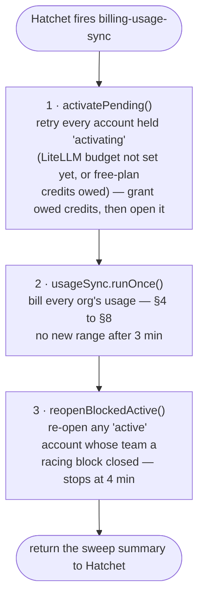

# The Billing Worker — Cron, Usage Sync, Alerts

How the billing cron works, end to end: what runs every minute, which orgs it
visits, the exact ClickHouse query, how usage becomes a Chargebee charge, when
Sentry is alerted, and what happens when the worker is down.

Code: `worker/hatchet-worker.ts`, `worker/passes.ts`, `worker/alerts.ts`,
`src/services/usage-sync.service.ts`, `src/integrations/clickhouse/usage-source.ts`,
`src/repositories/chargebee-sync.repository.ts`,
`src/repositories/billing-account.repository.ts`,
`src/integrations/chargebee/client.ts`, `src/models/sync-status.ts`.

**Money in one line.** `CREDITS_PER_USD=50`: $1 of AI usage is 50 credits.

---

## Contents

1. [The short version](#1-the-short-version)
2. [Where it runs](#2-where-it-runs)
3. [One tick](#3-one-tick)
4. [Which orgs are visited](#4-which-orgs-are-visited)
5. [One org's run](#5-one-orgs-run)
6. [Ranges and the cursor](#6-ranges-and-the-cursor)
7. [The ClickHouse query](#7-the-clickhouse-query)
8. [Charging Chargebee](#8-charging-chargebee)
9. [Sentry — the four alerts](#9-sentry--the-four-alerts)
10. [The daily resync](#10-the-daily-resync)
11. [When the worker is down](#11-when-the-worker-is-down)
12. [Running it by hand](#12-running-it-by-hand)
13. [Known gaps](#13-known-gaps)

---

## 1. The short version

1. A separate process, the **billing worker**, connects to **Hatchet**, which
   fires its cron **every minute**.
2. Each tick visits every org with a subscription. For each one it bills the
   **range** from the org's **cursor** up to `now − BILLING_LAG_MS`: every LLM
   call that **ended** after the cursor and at least **60 s** ago (the local
   `.env`: 45 s). Ordinarily that is the minute since the last tick; after an
   outage, **at most an hour** per charge. Usage reaches Chargebee **about 1–2
   minutes** after the call ended — the lag plus up to a minute to the next
   tick (measured: 52 s, with a 45 s lag).
3. It asks **ClickHouse** what the org's LLM calls that ended in that range
   cost, in USD.
4. It converts that to credits, writes a **`chargebee_sync` row first**, then
   **captures** the credits from the org's Chargebee balance.
5. Only when Chargebee confirms does the **cursor move** to the range's end. If
   Chargebee refuses for lack of balance, the org is marked **`exhausted`**, its
   LiteLLM team is **blocked**, and it is held until a top-up.
6. Four kinds of failure raise a **Sentry** alert: Postgres down, Postgres
   refusing a write, Chargebee down, Chargebee refusing usage. Running out of
   credits never does.
7. If the worker is down, **nothing is lost** — the usage waits in ClickHouse
   ahead of the cursor and is billed, an hour per charge, when it comes back —
   but the Chargebee balance **stands still**, running out of credits is **not
   detected**, and **no alert fires**. LiteLLM still enforces each team's
   budget in real time.

---

## 2. Where it runs

The API (`npm start` / `npm run dev`) and the worker are **two processes** from
the same code. The worker cannot live inside Next.js: it holds a long-lived
gRPC stream to Hatchet.

```bash
npm run worker        # tsx --env-file-if-exists=.env worker/hatchet-worker.ts
npm run worker:dev    # the same, restarting on file changes
```

At start it validates the whole configuration (a bad value stops the worker
instead of failing a tick a minute later), connects to Hatchet, and registers
two workflows. It refuses to start if none are registered — a cron that was
declared but never registered simply does not exist, and nothing complains.

| Workflow | Cron | Task | Timeout | Retries | Concurrency |
| --- | --- | --- | --- | --- | --- |
| `billing-usage-sync` | `* * * * *` — every minute | `sweep` | 5 min | 0 — the next tick is the retry | 1 run at a time; a tick that fires while one is still running is **cancelled** (`CANCEL_NEWEST`), so a run mid-capture always finishes. No new range is started after 3 minutes (§3). With `BILLING_SWEEP_INTERVAL_MS` under a minute, one run makes several passes (§3) |
| `billing-subscription-reconcile` | `11 2 * * *` — daily | `resync` | 15 min | 0 | — |

### Configuration

| Variable | Default | Meaning |
| --- | --- | --- |
| `HATCHET_CLIENT_TOKEN` | — | The worker's Hatchet token |
| `HATCHET_CLIENT_HOST_PORT` | SDK default | Hatchet engine address |
| `HATCHET_CLIENT_TLS_STRATEGY` | `none` locally | The local engine serves plaintext gRPC |
| `HATCHET_WORKER_SLOTS` | `5` | Tasks one worker runs at once |
| `BILLING_LAG_MS` | `60000` (60 s); `.env`: `45000` | Only LLM calls that **ended** at least this long ago, by ClickHouse's clock, are read. Below 30 s (`MIN_LAG_MS`) is refused at start — 0 included — unless `BILLING_ALLOW_SHORT_LAG=true` (tests only). A span landing later than the lag is never billed — see §6 |
| `BILLING_MAX_RANGE_MS` | `3600000` (1 h) | Longest range one charge covers — bounds a catch-up, and so the most an org that ran out mid-outage can have held; an ordinary pass bills the minute since the last |
| `BILLING_SWEEP_INTERVAL_MS` | `60000`; `.env`: `60000` | Time between passes: one a minute. Under a minute, each run makes several passes (none after 45 s) — an option, not used (§3). Above a minute behaves as a minute |
| `BILLING_MAX_ATTEMPTS` | `10` | Past this, an unknown outcome logs as `stuck` |
| `CLICKHOUSE_URL` / `_USER` / `_PASSWORD` | `http://localhost:8123`, `default` | ClickHouse |
| `CLICKHOUSE_TIMEOUT_MS` | `20000` | Also the query's `max_execution_time` |
| `CREDITS_PER_USD` | `1000` (`.env`: `50`) | USD → credits |
| `SENTRY_DSN` | empty = no alerts | Sentry project (set in the local `.env`) |

There is no fixed window: `BILLING_WINDOW_MS` and
`BILLING_MAX_WINDOWS_PER_TICK` no longer exist, and are ignored if still set.

---

## 3. One tick

The `sweep` task, every minute:



Step 2 runs **once** per minute (`BILLING_SWEEP_INTERVAL_MS=60000`).

*Option, not in use:* an interval under a minute makes step 2 run several
passes inside the one run — with `10000`, at 0, 10, 20, 30 and 40 s
(`worker/passes.ts`). No pass starts after 45 s and the gate check stops at
55 s, so the run ends before the next minute's tick, which Hatchet would
otherwise cancel (`CANCEL_NEWEST`). Each pass bills up to `now − lag`, so usage
reaches Chargebee sooner — the lag plus up to one interval after the call
ended — but every pass that finds usage is an extra Chargebee capture per org.
An interval above a minute changes nothing: the cron still fires every minute,
one pass each.

The order matters. Held accounts are retried **first** — one held for the free
plan's credits is granted them before it is opened — so one that activates is
billed in the same tick. The gate check is **last** — one LiteLLM read per
active account — so a hung LiteLLM cannot spend the tick's 5 minutes before a
single capture is sent.

**The time budget.** The usage sync stops **starting** new ranges, and new
orgs, 3 minutes into the run (`SYNC_DEADLINE_MS`; 45 s, `LAST_PASS_START_MS`,
with several passes); a range already started finishes. The gate check stops
starting accounts at 4 minutes (`GATE_CHECK_DEADLINE_MS`; 55 s with several
passes), and the task times out at 5. Only a catch-up comes near it: the orgs a
pass did not reach carry on next minute from their cursors, logged as the
warning `billing.sync.budget_spent`.

The summary is what the Hatchet dashboard shows for the run (locally
`http://localhost:8088`):

| Field | Meaning |
| --- | --- |
| `passes` | Usage-sync passes in this run |
| `activating`, `activated` | Accounts held, and how many opened this tick |
| `reopened` | Active accounts found with a blocked team — should be 0 |
| `tenantsScanned` | Orgs visited before the time budget ran out |
| `synced`, `replayed` | Orgs charged; orgs whose lost answer turned out to have landed |
| `idle` | Orgs with no usage |
| `unknown`, `rateLimited`, `invalid` | Orgs held on an unresolved range |
| `outOfCredits` | Orgs refused for lack of balance **this tick** |
| `exhausted` | Orgs held because their credits are used up |
| `holding`, `locked` | Waiting out a backoff; another worker had the range |
| `writtenOff` | Refused ranges on an ended subscription, given up |
| `erroredTenants` | Orgs whose run threw; the rest carried on |

---

## 4. Which orgs are visited

`accounts.listBillable()`:

- every `billing_account` with status **`active`** or **`exhausted`** and a
  subscription, **plus**
- every org holding an **unresolved** `chargebee_sync` row, whatever its status
  now — a charge that may have landed must be resolved even after the org
  cancelled.

Orgs are run **one after another**, in the order `listBillable` returns them
(there is no `ORDER BY`). One org's failure is caught, logged as
`billing.sync.tenant_error`, and counted; it never stops the others. A pass
stops starting new orgs past its time budget (§3): during a big catch-up the
orgs at the end of that order start later — next minute, from their cursors —
and nothing is lost.

---

## 5. One org's run

`runTenant(slug)`:

| # | Check | Outcome |
| --- | --- | --- |
| 1 | No billing account, no subscription, or no credit unit yet | `not_billable` — skipped |
| 2 | **`exhausted`** | Held whole: re-assert the LiteLLM block (a read when it is already there), send **nothing** to Chargebee, read **nothing** from ClickHouse. A refused range on a subscription that has since ended is written off |
| 3 | An **unresolved** `chargebee_sync` row | Resolve it **before reading anything new** (§8.4). Still unresolved → stop here: the cursor cannot pass it |
| 4 | **`cancelled`** | Stop — usage after a cancellation is not charged |
| 5 | Otherwise | Bill forward from the cursor, range by range (§6) |

---

## 6. Ranges and the cursor

**The cursor** is `billing_account.last_processed_ingested_at`: the time up to
which the org is fully billed — a call **end** time. The name is kept from when
it held ClickHouse's ingest time, as are `chargebee_sync.from_ingested_at` and
`to_ingested_at`, which hold a range's end-time bounds. The cursor is set to
**now** when the subscription is first linked — never to zero, or the first
tick would bill 90 days of old spans. It moves **only** when the range in front
of it is resolved, and only by compare-and-set.

**A call is billed by when it ended**: `Timestamp + duration_ms`. `Timestamp`
is when the call **started** (MEASURED on 2026-09-30: equal to LiteLLM's own
`startTime` within 0.1 s), and `duration_ms` is `Duration / 1e6` from platform
tenant migration 004's view; a missing or non-finite duration counts as 0. Both
are read from `span_nodes` as they are — billing adds no ClickHouse column and
no migration.

**A range** is `(cursor, min(now − BILLING_LAG_MS, cursor + BILLING_MAX_RANGE_MS)]`,
with `now` from ClickHouse's own clock. Its length is not fixed: an ordinary
pass bills the minute since the last one, a partial range is fine, and nothing
is read while the cursor is at or past `now − lag`. All times are full UTC
timestamps; midnight and month end are not special.

```
ClickHouse now = 12:10:05      lag 60 s → safe up to 12:09:05

cursor 12:08:05                (where the last pass ended)
  (12:08:05, 12:09:05]  ✓ read — the minute since the last pass
cursor 12:09:05                nothing more until the next pass
```

**One range, in order:** read ClickHouse → nothing in it: move the cursor to
the range's end, write no row → otherwise write the `chargebee_sync` row
(`PENDING`, its id the Chargebee operation id) → capture → `SUCCESS` → the
cursor moves to the range's end. The cursor moves only after Chargebee
confirms (§8).

**Catch-up.** A pass bills as many ranges per org as it needs, one capture per
range with usage, until the org is caught up or the pass's time budget (§3)
runs out:

```
ClickHouse now = 12:01:00      lag 60 s → safe up to 12:00:00      max range 1 h

cursor 09:00:00                (the worker stopped at 09:00)
  (09:00:00, 10:00:00]  ✓ one charge
  (10:00:00, 11:00:00]  ✓ one charge
  (11:00:00, 12:00:00]  ✓ one charge
cursor 12:00:00                caught up — back to a minute a pass
```

Why an hour at most: Chargebee refuses a capture larger than the balance
**whole**, so an org that ran out mid-outage has at most an hour of usage held,
not the whole outage. Longer outages are in §11.

**Why the lag is 60 s.** A span reaches ClickHouse well after its call ends.
LiteLLM exports spans in background batches (OTel `BatchSpanProcessor`, 5 s by
default), the collector batches them again (timeout 5 s), and then comes the
ClickHouse insert and its views — with retries on a failure. MEASURED on
2026-09-30 over 421 local spans: a span landed **23 s** (p50) and **44 s**
(p99) after its call ended; 3 of the 421 took over 45 s, 1 over 60 s. A span
that lands after its range was read is behind the cursor and is **never
billed** — which is what the lag is for. So `BILLING_LAG_MS` is 60 s by
default, and anything under 30 s (`MIN_LAG_MS`) stops the worker at start;
`BILLING_ALLOW_SHORT_LAG=true` lifts that floor, for tests only. The local
`.env` runs at 45 s: billed sooner, at the measured cost of 3 spans in 421.

**A re-sent span** carries the same `Timestamp` and duration as the first
copy, so it falls in the same range and is billed once: inside a range not yet
billed the `GROUP BY` counts it once, and once the range is billed it is behind
the cursor and never read again.

**How late the balance is.** A call is billed at the first pass whose
`now − lag` is past its end — the lag plus up to one interval after the call
ended:

| | Delay from the call's end to Chargebee |
| --- | --- |
| Best — the call's end passes `now − lag` just as a tick starts | **~lag** — 60 s (45 s locally) and a second to read and capture |
| Average — half a minute to the tick | **~lag + 30 s** — ~90 s |
| Worst — the call's end passes `now − lag` just after a tick | **~lag + 1 min** — ~2 min |

MEASURED live on 2026-09-30 (lag 45 s): a call that ended at 09:53:09.489 UTC
was billed in the range 09:52:12 → 09:53:12, captured at 09:54:01 — **~52 s**
after it ended — and the Chargebee balance matched exactly.

**Two workers, one cursor.** Two workers reading the same cursor a moment
apart compute **different** ends. The unique index on
`(tenant_id, from_ingested_at)` alone would not stop that: one could pass an
empty first minute and bill the second, while the other, which read the cursor
before, billed both minutes under another id. So a row is written only while
the cursor still sits at the range's start — `openWindow` compare-and-sets the
cursor onto itself, which checks it and locks the account row until the insert
commits — and an empty range is passed only under the same lock, and only if no
row owns its start (`advancePastEmptyWindow`). Exactly one of the two bills or
passes it; the other finds the cursor gone and backs off (`locked`). A retry
never recomputes a range: the stored row is re-sent under its own id, through
`captureIdempotent()`, which asks Chargebee before re-sending.

**An empty range** writes no row: the cursor simply moves past it (refused if
some other worker's row owns that start; a settled one is stepped over to its
end).

---

## 7. The ClickHouse query

One query per range, against the org's own database
`tenant_<routing slug>` (e.g. `tenant_org_ee_com`). The slug is checked against
`^[a-zA-Z0-9_]+$` before it becomes part of the table name.

```sql
SELECT
  count()          AS event_count,
  sum(billed_usd)  AS billed_usd
FROM (
  SELECT
    concat(TraceId, ':', SpanId)                           AS event_key,
    any(toFloat64OrZero(attrs['gen_ai.cost.total_cost']))  AS billed_usd
  FROM tenant_org_ee_com.span_nodes FINAL
  WHERE SpanName = {span:String}                          -- 'litellm_request'
    AND attrs['gen_ai.cost.total_cost'] != ''
    AND JSONExtractString(attrs['hidden_params'], 'cache_key') = ''
    AND Timestamp >  {from:DateTime64(3)} - INTERVAL 1 HOUR   -- day-partition pruning
    AND Timestamp <= {to:DateTime64(3)}
    AND addMilliseconds(Timestamp, if(isFinite(duration_ms) AND duration_ms > 0, toInt64(duration_ms), 0))
          >  {from:DateTime64(3)}                         -- the cursor
    AND addMilliseconds(Timestamp, if(isFinite(duration_ms) AND duration_ms > 0, toInt64(duration_ms), 0))
          <= {to:DateTime64(3)}                           -- min(now − lag, cursor + 1 h)
  GROUP BY event_key
)
```

It returns one row — `event_count` and `billed_usd` — even for an empty range.
The range's end is set from ClickHouse's own clock
(`SELECT toUnixTimestamp64Milli(now64(3))`), not the worker's, so the lag is
measured where the spans land.

Billing needs no ClickHouse change. The tenant migrations once planned for it —
029 (`span_nodes.ingested_at`) and 030 (first copy wins) — are withdrawn, and
`ingested_at` is not read.

| Part | Why |
| --- | --- |
| `span_nodes FINAL` | Only the tenant's table, never merged with `otel_landing` (that would count every span twice). `span_nodes` is a ReplacingMergeTree keyed on `(TraceId, SpanId)`, so `FINAL` collapses a re-sent span to one row — and the `GROUP BY` counts it once without relying on that |
| `SpanName = 'litellm_request'` | The span LiteLLM emits for each call, carrying model, tokens and cost |
| `total_cost != ''` | A failed attempt carries no cost. A fallback that succeeded on a second model **is** billed — it made a second provider call |
| `cache_key = ''` | A reply served from LiteLLM's Redis cache still carries a cost, but LiteLLM spent nothing on it: cache hits are not billed |
| `Timestamp + duration_ms` — when the call **ended** | A span is written once its call ends, so the end is the earliest a range can be complete. A range on the start would have to wait out the longest call (LiteLLM's 600 s `request_timeout`). A missing or non-finite duration counts as 0 |
| `Timestamp` between `from − 1 h` and `to` | `span_nodes` is partitioned by day of `Timestamp`. A call that ended in the range started at most an hour before it (the gateway gives up after 600 s, retries included), so the read prunes to one or two day partitions |
| `> from`, `<= to` | Half-open on **times**: every millisecond belongs to exactly one range, so ranges neither overlap nor leave gaps |
| `GROUP BY TraceId:SpanId`, then `count`/`sum` | Counts each call once inside the range, and sums cost over the de-duplicated calls, never over raw rows |
| `any()` on the cost | Copies of one span carry the same cost; `max()` would be a quiet upward bias |

There is no `SETTINGS` clause; the client sets only `max_execution_time`, from
`CLICKHOUSE_TIMEOUT_MS`.

**From dollars to credits.** `amount = billed_usd × CREDITS_PER_USD`, at
Chargebee's precision (10 decimal places). A range costing **$0.10** is
**5 credits**.

---

## 8. Charging Chargebee

### 8.1 Row first, then the call

| # | Step | Writes / calls |
| --- | --- | --- |
| 1 | **Open the range**: insert a `chargebee_sync` row, status `PENDING`, with the range, `event_count`, `billed_usd`, `amount`, and the subscription and credit unit **pinned** — only while the cursor still sits at the range's start, under the account row's lock (`openWindow`). Its `id` is also the Chargebee operation id. The unique index `(tenant_id, from_ingested_at)` lets only one row own a start | Postgres |
| 2 | Zero credits (e.g. free models)? The row is written `SUCCESS` and the cursor moves — Chargebee refuses a zero amount | Postgres |
| 3 | **Claim** it: `PENDING → PROCESSING`, compare-and-set on status and attempt count. Two callers that read the same row — exactly one sends | Postgres |
| 4 | **Capture** | Chargebee `POST /ledger_operations/capture` |
| 5 | Record the answer — only if the claim is still ours | Postgres |
| 6 | `SUCCESS` → **move the cursor** to the range's end (compare-and-set) | Postgres |
| 7 | The balance left is 0, or the capture was refused for lack of balance → **`exhausted`**, LiteLLM team **blocked** (`/team/update`, reason `exhausted`) | Postgres, LiteLLM |

The capture request:

```
POST /api/v2/ledger_operations/capture
  id                          = <chargebee_sync.id>
  subscription_id             = <pinned subscription>
  unit_id                     = <pinned credit unit, e.g. token-test>
  amount                      = <credits>
  ledger_operation_timestamp  = now          (Chargebee refuses anything older than 10 minutes)
  metadata[json]              = {tenant_slug, ingested_from, ingested_to, event_count, billed_usd}
                                (ingested_from/_to: the range's call end-time bounds; the names are kept)
```

Each Chargebee request has a **20 s** timeout and at most **3** attempts
(0.5 s, then 1 s apart). A capture is re-sent in place **only on a 429** —
refused before it was applied. A timeout, a dropped connection or a 5xx may
have landed, so it is never re-sent blind: it becomes `UNKNOWN`, and the next
tick asks Chargebee first.

### 8.2 What Chargebee's answer becomes

| Chargebee says | Row status | Cursor | Effect |
| --- | --- | --- | --- |
| 200 | `SUCCESS` | moves | Charged. A 0 balance after it → `exhausted` |
| "duplicate id", and a lookup finds the operation | `SUCCESS` (replayed) | moves | It had landed earlier; charged once |
| 429 | `RATE_LIMITING` | held | Sent again after 1 min, doubling to 15 min |
| timeout, 5xx, bad key, site disabled | `UNKNOWN` | held | Next tick: look it up, send only on a definite 404 |
| insufficient balance | `OUT_OF_CREDITS` | held | Refused **whole** — the balance never goes negative. `exhausted`, team blocked; not retried until credits come back |
| no prepaid ledger on the subscription | `INVALID` | held | Needs a person; retried 5 min doubling to 1 h |
| any other 4xx | `INVALID` | held | Same |
| refused, and the subscription has since ended | `WRITTEN_OFF` | moves | Given up once, logged `billing.sync.written_off` with the amount |

### 8.3 Why nothing is charged twice or skipped

- **Nothing skipped:** an unresolved range holds the cursor, so the same usage
  is offered again next tick. No requeue step exists because nothing was ever
  taken off a queue.
- **Nothing charged twice:** the row id *is* the Chargebee operation id,
  written before the send. After a lost answer the next tick asks
  `GET /ledger_operations/{id}` instead of guessing — and re-sends the stored
  row, never a recomputed range.
- **No second row for a range:** the unique index, a row written only while
  the cursor still sits at its start (under the account row's lock), and
  cursor moves by compare-and-set.
- **No second sender:** the claim, and a 5-minute `PROCESSING` lease — longer
  than any one send can take.

### 8.4 Resolving a held row (before anything new is read)

| Status | Retried |
| --- | --- |
| `PENDING` | Every tick — never sent, so sent straight away |
| `PROCESSING` | Once its 5-minute lease is over (its sender died), by lookup |
| `UNKNOWN` | Every tick, by lookup |
| `RATE_LIMITING` | 1 min doubling to 15 min |
| `INVALID` | 5 min doubling to 1 h |
| `OUT_OF_CREDITS` | Not at all while `exhausted`; at once when a top-up, renewal or resync makes the account active again |

Every retry except a never-sent `PENDING` goes through
`captureIdempotent()`: `GET /ledger_operations/{id}` first, and a capture only
on a definite 404.

---

## 9. Sentry — the four alerts

`worker/alerts.ts`. With `SENTRY_DSN` set (it is, in the local `.env`), the
worker sends **only these four**. Everything else the SDK would send is dropped
in `beforeSend` and stays in the logs.

| Alert (`alert` tag) | Title | Raised when | Comes from |
| --- | --- | --- | --- |
| `postgres-down` | Billing worker cannot reach Postgres | Any database call — read or write — cannot reach Postgres | The Prisma client itself (`onQueryFailure`), so even a write the sync catches is seen |
| `postgres-write-failed` | Billing worker could not write to Postgres | Postgres is up and refused a write: read-only failover, full disk, revoked grant, bad value | Prisma client. Not a unique violation — the guard indexes refuse duplicates on purpose |
| `chargebee-down` | Chargebee is down or refusing the billing worker | Usage-sync error metric `billing.sync.unknown_outcome` (5xx, timeout, dropped socket), `.site_disabled` (403), `.unauthenticated` (401), `.stuck` (unknown past `BILLING_MAX_ATTEMPTS`) | The usage sync's own error log line |
| `chargebee-update-failed` | Usage could not be written to Chargebee | `billing.sync.invalid` (Chargebee refused the request) or `.no_ledger` (subscription has no prepaid ledger) | The usage sync's error log line |

**One issue per alert.** Each has a fixed fingerprint
(`["billing-worker", <key>]`), so a Chargebee outage hitting 50 orgs every
minute is **one** Sentry issue with a growing event count, tagged with the
`metric` and the org (`tenant`), and the full log fields in its context.

**Never an alert:**

| Metric | Why |
| --- | --- |
| `billing.sync.out_of_credits` | The customer's state, not a fault; it clears on a top-up |
| `billing.sync.rate_limited` | Backs off and heals |
| `billing.sync.tenant_error` | Any other failure; a database one is already raised from the client |
| `billing.sync.behind` | Logged at `error`, but **not** mapped to Sentry |
| `billing.sync.budget_spent` | A warning: a pass used its time budget, and the orgs it did not reach carry on next minute |
| `billing.budget.block_failed`, `.push_failed` | Logged; retried every tick |

---

## 10. The daily resync

`billing-subscription-reconcile`, cron `11 2 * * *`. For **every org with a
Chargebee customer**, `syncFromChargebee()` re-reads its subscriptions and
applies them — the repair for a webhook that never arrived:

- a missed `subscription_renewed` (the gateway would enforce the old term's
  credits);
- a missed `subscription_created` (a paid org never linked);
- a missed cancellation (billing a subscription Chargebee has ended);
- credits granted by hand in Chargebee, which bring an `exhausted` org back.

One org's failure is logged (`billing.subscription_reconcile.tenant_error`) and
the rest continue. The run returns `scanned`, `repaired`, `errors`.

---

## 11. When the worker is down

Hatchet keeps firing the cron, but no worker takes the runs. Missed ticks are
not replayed one by one — and do not need to be, because the **cursor**, not
the run, remembers where billing is.

### What stops

| | While the worker is down |
| --- | --- |
| Usage billing | Stops. Every org's cursor stays where it was, and no capture is sent |
| The Chargebee balance | **Frozen** at the last capture — the billing page shows credits the org may already have spent |
| Running out of credits | **Not detected by billing.** Exhaustion is only noticed when Chargebee refuses a capture, and there are no captures. LiteLLM still stops a team at its budget in real time, but only on calls made with the team's key: agent-core calls LiteLLM with the master key, whose spend is not counted against the team. **Through agent-core, orgs can spend past their credits for as long as the worker is down** |
| Held `activating` | Not retried — neither the budget push nor owed free-plan credits — so the customer stays blocked |
| Active orgs with a stray block | Not reopened |
| Daily resync | Does not run — a missed webhook is not repaired |
| Sentry | **Silent.** The worker is what raises the alerts; no alert says it is gone |

### What keeps working

| | |
| --- | --- |
| Usage data | Safe in ClickHouse — up to its **90-day** retention |
| The billing page, checkout, top-ups | The API process, not the worker |
| Webhooks | Handled by the API: subscriptions link, top-ups are granted |
| Enforcement already in place | LiteLLM enforces each team's budget in real time; blocked teams stay blocked; the gateway gate still refuses orgs with no plan or a block |

### Coming back

1. **A row a dead worker left `PROCESSING`** waits out its 5-minute lease, then
   is looked up in Chargebee and settled — sent only if Chargebee has never
   seen it.
2. **The backlog drains in order**, from each org's cursor, in ranges of at
   most an hour (`BILLING_MAX_RANGE_MS`) — one Chargebee capture per range with
   usage, several per org in one pass:

   | Down for | First run after restart |
   | --- | --- |
   | 09:00 → 12:00 | Three one-hour charges per busy org |
   | 1 day | 24 charges per busy org — ~25 s per busy org at ~1 s per Chargebee call; ~2 s for an idle org |

   A pass stops starting new ranges and new orgs after 3 minutes (§3). The orgs
   it did not reach — the ones at the end of `listBillable`'s order — start in
   the next minute's run, from their cursors, logged as
   `billing.sync.budget_spent`. Nothing is lost; they are only billed later.
3. **Overspend lands.** The first range that costs more than the balance left
   is refused **whole**: the org becomes `exhausted` and is blocked, and every
   range after it waits. Since a range is at most an hour, that is at most an
   hour of usage held; the customer must top up enough to cover it before the
   rest is billed.
4. **`billing.sync.behind`** is logged for any org whose cursor is more than
   **7 days** old — well before ClickHouse's 90-day retention turns unbilled
   usage into lost usage.

### A crash in the middle of a tick

| Crash point | Left behind | Next tick |
| --- | --- | --- |
| Before the row is written | Nothing | Reads again from the same cursor (the range may now end later) |
| Row `PENDING`, never sent | The row | Sends it — safe, the id was never on the wire |
| Row `PROCESSING`, request out | The row | After the 5-min lease: lookup, then send or settle |
| Charged, answer not recorded | The row | Lookup finds it: `SUCCESS` (replayed) |
| Recorded, cursor not moved | A settled row ahead of the cursor | Steps the cursor over the settled row, to that row's end |

### Two workers at once

Safe — during a rollout, or with the manual route below running beside the
cron. Two workers reading one cursor compute different ends, and exactly one
bills or passes the range (§6): the range index and the cursor check under the
account row's lock, the claim, the `PROCESSING` lease and the compare-and-set
cursor hold across processes. Hatchet's one-run-at-a-time rule is not what
correctness rests on.

---

## 12. Running it by hand

On the billing API, from inside the private network (the platform does not
proxy it):

```bash
# every billable org — the same sync the cron runs
curl -X POST http://localhost:4300/api/internal/sync -H 'content-type: application/json' -d '{}'

# chosen orgs only
curl -X POST http://localhost:4300/api/internal/sync -H 'content-type: application/json' \
  -d '{"slugs":["org_ee_com"]}'
```

It answers with the usage sync's own summary — the tick's usage counts, plus
each org's result — and, like a pass, starts no new range after 3 minutes. It
runs only the usage sync — not `activatePending` or the gate check.

---

## 13. Known gaps

1. **No alert when the worker is down.** Sentry hears only from a running
   worker. Add a heartbeat: a Sentry cron monitor (check-in at the start and
   end of each tick) or a Hatchet alert on missing runs.

2. **Overspend while the worker is down is unbounded.** LiteLLM enforces team
   budgets in real time, but agent-core's calls are not counted in LiteLLM
   team spend, so the gateway cannot stop an org on its own. Per-org virtual
   keys in agent-core would let LiteLLM enforce the budget in real time.

3. **Exhaustion is noticed 1–2 minutes late** even when the worker is up: the
   60 s lag plus up to a minute to the next tick. The gateway does not count
   agent-core's calls against the team, so until the capture is refused those
   keep spending. The overspend is held and billed after a top-up.

4. **`billing.sync.behind` is only a log line**, not a Sentry alert, although it
   is the one signal that usage is getting close to ClickHouse's retention.

5. **A span that lands later than the lag is never billed.** Its range was
   read without it, and it is behind the cursor. Measured: 1 span in 421 at
   the default 60 s, 3 in 421 at the local 45 s. A longer lag loses fewer and
   bills later.
