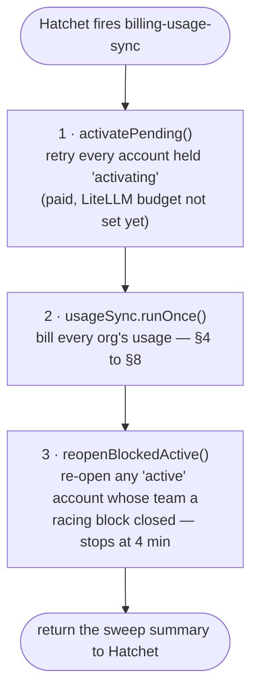

# The Billing Worker — Cron, Usage Sync, Alerts

How the billing cron works, end to end: what runs every minute, which orgs it
visits, the exact ClickHouse query, how usage becomes a Chargebee charge, when
Sentry is alerted, and what happens when the worker is down.

Code: `worker/hatchet-worker.ts`, `worker/alerts.ts`,
`src/services/usage-sync.service.ts`, `src/integrations/clickhouse/usage-source.ts`,
`src/integrations/chargebee/client.ts`, `src/models/sync-status.ts`.

**Money in one line.** `CREDITS_PER_USD=50`: $1 of AI usage is 50 credits.

---

## Contents

1. [The short version](#1-the-short-version)
2. [Where it runs](#2-where-it-runs)
3. [One tick](#3-one-tick)
4. [Which orgs are visited](#4-which-orgs-are-visited)
5. [One org's run](#5-one-orgs-run)
6. [Windows and the cursor](#6-windows-and-the-cursor)
7. [The ClickHouse query](#7-the-clickhouse-query)
8. [Charging Chargebee](#8-charging-chargebee)
9. [Sentry — the four alerts](#9-sentry--the-four-alerts)
10. [The daily resync](#10-the-daily-resync)
11. [When the worker is down](#11-when-the-worker-is-down)
12. [Running it by hand](#12-running-it-by-hand)
13. [Known gaps](#13-known-gaps)

---

## 1. The short version

1. A separate process, the **billing worker**, connects to **Hatchet**, which
   fires its cron **every minute**.
2. Each tick visits every org with a subscription. For each one it takes the
   next **one-minute window** of usage after the org's **cursor**, but only
   once that window ended at least `BILLING_LAG_MS` ago — **10 s**. Usage reaches Chargebee **about a minute** after
   the call: ~15 s at best, ~2 min 20 s at worst (measured: 92 s).
3. It asks **ClickHouse** what the org's LLM calls in that window cost, in USD.
4. It converts that to credits, writes a **`chargebee_sync` row first**, then
   **captures** the credits from the org's Chargebee balance.
5. Only when Chargebee confirms does the **cursor move** past the window. If
   Chargebee refuses for lack of balance, the org is marked **`exhausted`**, its
   LiteLLM team is **blocked**, and it is held until a top-up.
6. Four kinds of failure raise a **Sentry** alert: Postgres down, Postgres
   refusing a write, Chargebee down, Chargebee refusing usage. Running out of
   credits never does.
7. If the worker is down, **nothing is lost** — the usage waits in ClickHouse
   behind the cursor and is billed when it comes back — but **nothing is
   enforced** either, and **no alert fires**.

---

## 2. Where it runs

The API (`npm start` / `npm run dev`) and the worker are **two processes** from
the same code. The worker cannot live inside Next.js: it holds a long-lived
gRPC stream to Hatchet.

```bash
npm run worker        # tsx --env-file-if-exists=.env worker/hatchet-worker.ts
npm run worker:dev    # the same, restarting on file changes
```

At start it validates the whole configuration (a bad value stops the worker
instead of failing a tick a minute later), connects to Hatchet, and registers
two workflows. It refuses to start if none are registered — a cron that was
declared but never registered simply does not exist, and nothing complains.

| Workflow | Cron | Task | Timeout | Retries | Concurrency |
| --- | --- | --- | --- | --- | --- |
| `billing-usage-sync` | `* * * * *` — every minute | `sweep` | 5 min | 0 — the next tick is the retry | 1 run at a time; a tick that fires while one is still running is **cancelled** (`CANCEL_NEWEST`), so a run mid-capture always finishes. With `BILLING_SWEEP_INTERVAL_MS` under a minute, one run makes several passes (§3) |
| `billing-subscription-reconcile` | `11 2 * * *` — daily | `resync` | 15 min | 0 | — |

### Configuration

| Variable | Default | Meaning |
| --- | --- | --- |
| `HATCHET_CLIENT_TOKEN` | — | The worker's Hatchet token |
| `HATCHET_CLIENT_HOST_PORT` | SDK default | Hatchet engine address |
| `HATCHET_CLIENT_TLS_STRATEGY` | `none` locally | The local engine serves plaintext gRPC |
| `HATCHET_WORKER_SLOTS` | `5` | Tasks one worker runs at once |
| `BILLING_LAG_MS` | `10000` (10 s) | Only usage ingested at least this long ago is read. Below 10 s is refused unless `BILLING_ALLOW_SHORT_LAG=true` (tests). 10 s is safe — see §6 (it was 2 minutes before that was measured) |
| `BILLING_WINDOW_MS` | `60000` (1 min); `.env`: `60000` | Window length. **Fixed** — see §6 |
| `BILLING_MAX_WINDOWS_PER_TICK` | `20` | Windows one org may bill in one pass |
| `BILLING_SWEEP_INTERVAL_MS` | `60000`; `.env`: `60000` | Time between passes: one a minute. Under a minute, each run makes several passes — an option, not used (§3) |
| `BILLING_MAX_ATTEMPTS` | `10` | Past this, an unknown outcome logs as `stuck` |
| `CLICKHOUSE_URL` / `_USER` / `_PASSWORD` | `http://localhost:8123`, `default` | ClickHouse |
| `CLICKHOUSE_TIMEOUT_MS` | `20000` | Also the query's `max_execution_time` |
| `CREDITS_PER_USD` | `1000` (`.env`: `50`) | USD → credits |
| `SENTRY_DSN` | empty = no alerts | Sentry project (set in the local `.env`) |

---

## 3. One tick

The `sweep` task, every minute:



Step 2 runs **once** per minute (`BILLING_SWEEP_INTERVAL_MS=60000`).

*Option, not in use:* an interval under a minute makes step 2 run several
passes inside the one run — with `10000`, at 0, 10, 20, 30 and 40 s
(`worker/passes.ts`). No pass starts after 45 s and the gate check stops at
55 s, so the run ends before the next minute's tick, which Hatchet would
otherwise cancel (`CANCEL_NEWEST`). It only speeds billing up together with a
shorter `BILLING_WINDOW_MS`, and every extra window with usage is an extra
Chargebee capture.

The order matters. Held accounts are retried **first**, so one that activates
is billed in the same tick. The gate check is **last** — one LiteLLM read per
active account — so a hung LiteLLM cannot spend the tick's 5 minutes before a
single capture is sent.

The summary is what the Hatchet dashboard shows for the run (locally
`http://localhost:8088`):

| Field | Meaning |
| --- | --- |
| `passes` | Usage-sync passes in this run |
| `activating`, `activated` | Accounts held, and how many opened this tick |
| `reopened` | Active accounts found with a blocked team — should be 0 |
| `tenantsScanned` | Orgs visited |
| `synced`, `replayed` | Windows charged; charges whose lost answer turned out to have landed |
| `idle` | Orgs with no usage |
| `unknown`, `rateLimited`, `invalid` | Orgs held on an unresolved window |
| `outOfCredits` | Orgs refused for lack of balance **this tick** |
| `exhausted` | Orgs held because their credits are used up |
| `holding`, `locked` | Waiting out a backoff; another worker had the window |
| `writtenOff` | Refused windows on an ended subscription, given up |
| `erroredTenants` | Orgs whose run threw; the rest carried on |

---

## 4. Which orgs are visited

`accounts.listBillable()`:

- every `billing_account` with status **`active`** or **`exhausted`** and a
  subscription, **plus**
- every org holding an **unresolved** `chargebee_sync` row, whatever its status
  now — a charge that may have landed must be resolved even after the org
  cancelled.

Orgs are run **one after another**. One org's failure is caught, logged as
`billing.sync.tenant_error`, and counted; it never stops the others.

---

## 5. One org's run

`runTenant(slug)`:

| # | Check | Outcome |
| --- | --- | --- |
| 1 | No billing account, no subscription, or no credit unit yet | `not_billable` — skipped |
| 2 | **`exhausted`** | Held whole: re-assert the LiteLLM block (a read when it is already there), send **nothing** to Chargebee, read **nothing** from ClickHouse. A refused window on a subscription that has since ended is written off |
| 3 | An **unresolved** `chargebee_sync` row | Resolve it **before reading anything new** (§8.4). Still unresolved → stop here: the cursor cannot pass it |
| 4 | **`cancelled`** | Stop — usage after a cancellation is not charged |
| 5 | Otherwise | Bill forward, window by window (§6) |

---

## 6. Windows and the cursor

**The cursor** is `billing_account.last_processed_ingested_at`: the
`ingested_at` up to which the org is fully billed. It is set to **now** when the
subscription is first linked — never to zero, or the first tick would bill 90
days of old spans. It moves **only** when the window in front of it is
resolved, and only by compare-and-set.

**A window** is `(cursor, cursor + BILLING_WINDOW_MS]` — a fixed length from
the cursor. It is processed only once it ends at least `BILLING_LAG_MS` before
ClickHouse's own clock, so every span stamped inside it has become visible. Up
to 20 windows per org per pass.

```
ClickHouse now = 12:10:05      lag 10 s → safe up to 12:09:55

cursor 12:07:00
  (12:07:00, 12:08:00]  ✓ read
  (12:08:00, 12:09:00]  ✓ read
  (12:09:00, 12:10:00]  ✗ ends after 12:09:55 — next tick
```

**Why a 10 s lag is enough.** ClickHouse stamps `ingested_at` when it writes the
span into the org's `span_nodes` (the column's `DEFAULT now64(3)`), and the
span is visible once that write commits. MEASURED on 2026-09-29 over 7 days of
`system.query_views_log`: 10,058 writes, slowest **389 ms**, 99% under
**19 ms**. The collector's batching happens before the stamp, so it does not
count. A span visible only after the cursor had passed its stamp would never be
billed — which is what the lag is for, with 25× margin here.

**How late the balance is.** A span reaches ClickHouse a few seconds after its
call — the OTel collector sends in 5-second batches (measured: 7 s) — and is
stamped then. Its window can be read 10 s after the window ends, at the first
tick after that:

| | Delay from the call to Chargebee |
| --- | --- |
| Best — stamped at the window's end, a tick just 10 s later | **~15 s** |
| Average — ~7 s to ClickHouse + half a window + 10 s lag + half a minute to the tick | **~75 s** |
| Worst — stamped at the window's start, a tick just missed | **~2 min 20 s** |

MEASURED on 2026-09-29 with one call for `org_ee_com`: in ClickHouse 7 s after
the call, captured in Chargebee **92 s** after it.

Why a **fixed** length and not "up to now": two workers reading the same cursor
a few milliseconds apart would compute different ends. The row index is on
`(tenant_id, from_ingested_at)`, so it would not see them as the same window,
and one could charge a range the other then charges again. With the end derived
from the start, two workers either collide on the index or agree exactly.

**An empty window** writes no row: the cursor simply moves past it (refused if
some other worker's row owns that start).

---

## 7. The ClickHouse query

One query per window, against the org's own database
`tenant_<routing slug>` (e.g. `tenant_org_ee_com`). The slug is checked against
`^[a-zA-Z0-9_]+$` before it becomes part of the table name.

```sql
SELECT
  count()          AS event_count,
  sum(billed_usd)  AS billed_usd
FROM (
  SELECT
    concat(TraceId, ':', SpanId)                           AS event_key,
    any(toFloat64OrZero(attrs['gen_ai.cost.total_cost']))  AS billed_usd
  FROM tenant_org_ee_com.span_nodes FINAL
  WHERE SpanName = {span:String}                          -- 'litellm_request'
    AND attrs['gen_ai.cost.total_cost'] != ''
    AND JSONExtractString(attrs['hidden_params'], 'cache_key') = ''
    AND ingested_at >  {from:DateTime64(3)}               -- the cursor
    AND ingested_at <= {to:DateTime64(3)}                 -- cursor + 60 s
  GROUP BY event_key
)
SETTINGS use_skip_indexes_if_final = 1, use_skip_indexes_if_final_exact_mode = 1
```

It returns one row — `event_count` and `billed_usd` — even for an empty window.
The window's end is also compared with ClickHouse's own clock
(`SELECT toUnixTimestamp64Milli(now64(3))`), because ClickHouse stamps
`ingested_at`.

| Part | Why |
| --- | --- |
| `span_nodes FINAL` | Only the tenant's table, never merged with `otel_landing` (that would count every span twice). `span_nodes` is a ReplacingMergeTree keyed on `(TraceId, SpanId)`, and since tenant migration 030 a re-sent span keeps its **first** copy: `FINAL` returns each span once, at its earliest `ingested_at`, so a re-send landing in a later window is never billed again |
| `SpanName = 'litellm_request'` | The span LiteLLM emits for each call, carrying model, tokens and cost |
| `total_cost != ''` | A failed attempt carries no cost. A fallback that succeeded on a second model **is** billed — it made a second provider call |
| `cache_key = ''` | A reply served from LiteLLM's Redis cache still carries a cost, but LiteLLM spent nothing on it: cache hits are not billed |
| `ingested_at`, not `Timestamp` | The worker polls for usage that has **arrived**, not usage that happened. A span can land long after its call; a cursor on call time would skip it for good |
| `> from`, `<= to` | Half-open on **times**: every millisecond belongs to exactly one window, so windows neither overlap nor leave gaps |
| `GROUP BY TraceId:SpanId`, then `count`/`sum` | Counts each call once inside the window, and sums cost over the de-duplicated calls, never over raw rows |
| `any()` on the cost | Copies of one span carry the same cost; `max()` would be a quiet upward bias |
| `…_exact_mode = 1` | Part of the exactly-once guarantee: without it the skip index can drop the granules holding the first copy, and `FINAL` would see only the re-send. Keep the `ingested_at` filter in `WHERE`, never `PREWHERE`, for the same reason |

**From dollars to credits.** `amount = billed_usd × CREDITS_PER_USD`, at
Chargebee's precision (10 decimal places). A window costing **$0.10** is
**5 credits**.

---

## 8. Charging Chargebee

### 8.1 Row first, then the call

| # | Step | Writes / calls |
| --- | --- | --- |
| 1 | **Open the window**: insert a `chargebee_sync` row, status `PENDING`, with the range, `event_count`, `billed_usd`, `amount`, and the subscription and credit unit **pinned**. Its `id` is also the Chargebee operation id. The unique index `(tenant_id, from_ingested_at)` lets only one row own a window | Postgres |
| 2 | Zero credits (e.g. free models)? The row is written `SUCCESS` and the cursor moves — Chargebee refuses a zero amount | Postgres |
| 3 | **Claim** it: `PENDING → PROCESSING`, compare-and-set on status and attempt count. Two callers that read the same row — exactly one sends | Postgres |
| 4 | **Capture** | Chargebee `POST /ledger_operations/capture` |
| 5 | Record the answer — only if the claim is still ours | Postgres |
| 6 | `SUCCESS` → **move the cursor** to the window's end (compare-and-set) | Postgres |
| 7 | The balance left is 0, or the capture was refused for lack of balance → **`exhausted`**, LiteLLM team **blocked** (`/team/update`, reason `exhausted`) | Postgres, LiteLLM |

The capture request:

```
POST /api/v2/ledger_operations/capture
  id                          = <chargebee_sync.id>
  subscription_id             = <pinned subscription>
  unit_id                     = <pinned credit unit, e.g. token-test>
  amount                      = <credits>
  ledger_operation_timestamp  = now          (Chargebee refuses anything older than 10 minutes)
  metadata[json]              = {tenant_slug, ingested_from, ingested_to, event_count, billed_usd}
```

Each Chargebee request has a **20 s** timeout and at most **3** attempts
(0.5 s, then 1 s apart). A capture is re-sent in place **only on a 429** —
refused before it was applied. A timeout, a dropped connection or a 5xx may
have landed, so it is never re-sent blind: it becomes `UNKNOWN`, and the next
tick asks Chargebee first.

### 8.2 What Chargebee's answer becomes

| Chargebee says | Row status | Cursor | Effect |
| --- | --- | --- | --- |
| 200 | `SUCCESS` | moves | Charged. A 0 balance after it → `exhausted` |
| "duplicate id", and a lookup finds the operation | `SUCCESS` (replayed) | moves | It had landed earlier; charged once |
| 429 | `RATE_LIMITING` | held | Sent again after 1 min, doubling to 15 min |
| timeout, 5xx, bad key, site disabled | `UNKNOWN` | held | Next tick: look it up, send only on a definite 404 |
| insufficient balance | `OUT_OF_CREDITS` | held | Refused **whole** — the balance never goes negative. `exhausted`, team blocked; not retried until credits come back |
| no prepaid ledger on the subscription | `INVALID` | held | Needs a person; retried 5 min doubling to 1 h |
| any other 4xx | `INVALID` | held | Same |
| refused, and the subscription has since ended | `WRITTEN_OFF` | moves | Given up once, logged `billing.sync.written_off` with the amount |

### 8.3 Why nothing is charged twice or skipped

- **Nothing skipped:** an unresolved window holds the cursor, so the same usage
  is offered again next tick. No requeue step exists because nothing was ever
  taken off a queue.
- **Nothing charged twice:** the row id *is* the Chargebee operation id,
  written before the send. After a lost answer the next tick asks
  `GET /ledger_operations/{id}` instead of guessing.
- **No second row for a window:** the unique index, and cursor moves by
  compare-and-set.
- **No second sender:** the claim, and a 5-minute `PROCESSING` lease — longer
  than any one send can take.

### 8.4 Resolving a held row (before anything new is read)

| Status | Retried |
| --- | --- |
| `PENDING` | Every tick — never sent, so sent straight away |
| `PROCESSING` | Once its 5-minute lease is over (its sender died), by lookup |
| `UNKNOWN` | Every tick, by lookup |
| `RATE_LIMITING` | 1 min doubling to 15 min |
| `INVALID` | 5 min doubling to 1 h |
| `OUT_OF_CREDITS` | Not at all while `exhausted`; at once when a top-up, renewal or resync makes the account active again |

Every retry except a never-sent `PENDING` goes through
`captureIdempotent()`: `GET /ledger_operations/{id}` first, and a capture only
on a definite 404.

---

## 9. Sentry — the four alerts

`worker/alerts.ts`. With `SENTRY_DSN` set (it is, in the local `.env`), the
worker sends **only these four**. Everything else the SDK would send is dropped
in `beforeSend` and stays in the logs.

| Alert (`alert` tag) | Title | Raised when | Comes from |
| --- | --- | --- | --- |
| `postgres-down` | Billing worker cannot reach Postgres | Any database call — read or write — cannot reach Postgres | The Prisma client itself (`onQueryFailure`), so even a write the sync catches is seen |
| `postgres-write-failed` | Billing worker could not write to Postgres | Postgres is up and refused a write: read-only failover, full disk, revoked grant, bad value | Prisma client. Not a unique violation — the guard indexes refuse duplicates on purpose |
| `chargebee-down` | Chargebee is down or refusing the billing worker | Usage-sync error metric `billing.sync.unknown_outcome` (5xx, timeout, dropped socket), `.site_disabled` (403), `.unauthenticated` (401), `.stuck` (unknown past `BILLING_MAX_ATTEMPTS`) | The usage sync's own error log line |
| `chargebee-update-failed` | Usage could not be written to Chargebee | `billing.sync.invalid` (Chargebee refused the request) or `.no_ledger` (subscription has no prepaid ledger) | The usage sync's error log line |

**One issue per alert.** Each has a fixed fingerprint
(`["billing-worker", <key>]`), so a Chargebee outage hitting 50 orgs every
minute is **one** Sentry issue with a growing event count, tagged with the
`metric` and the org (`tenant`), and the full log fields in its context.

**Never an alert:**

| Metric | Why |
| --- | --- |
| `billing.sync.out_of_credits` | The customer's state, not a fault; it clears on a top-up |
| `billing.sync.rate_limited` | Backs off and heals |
| `billing.sync.tenant_error` | Any other failure; a database one is already raised from the client |
| `billing.sync.behind` | Logged at `error`, but **not** mapped to Sentry |
| `billing.budget.block_failed`, `.push_failed` | Logged; retried every tick |

---

## 10. The daily resync

`billing-subscription-reconcile`, cron `11 2 * * *`. For **every org with a
Chargebee customer**, `syncFromChargebee()` re-reads its subscriptions and
applies them — the repair for a webhook that never arrived:

- a missed `subscription_renewed` (the gateway would enforce the old term's
  credits);
- a missed `subscription_created` (a paid org never linked);
- a missed cancellation (billing a subscription Chargebee has ended);
- credits granted by hand in Chargebee, which bring an `exhausted` org back.

One org's failure is logged (`billing.subscription_reconcile.tenant_error`) and
the rest continue. The run returns `scanned`, `repaired`, `errors`.

---

## 11. When the worker is down

Hatchet keeps firing the cron, but no worker takes the runs. Missed ticks are
not replayed one by one — and do not need to be, because the **cursor**, not
the run, remembers where billing is.

### What stops

| | While the worker is down |
| --- | --- |
| Usage billing | Stops. Every org's cursor stays where it was |
| Running out of credits | **Not detected.** Exhaustion is only noticed when Chargebee refuses a capture, and there are no captures. Agent-core calls LiteLLM with the master key, whose spend is not counted against the team, so LiteLLM's own budget does not stop the org either. **Orgs can spend past their credits for as long as the worker is down** |
| Paid, held `activating` | Not retried — the customer stays blocked |
| Active orgs with a stray block | Not reopened |
| Daily resync | Does not run — a missed webhook is not repaired |
| Sentry | **Silent.** The worker is what raises the alerts; no alert says it is gone |

### What keeps working

| | |
| --- | --- |
| Usage data | Safe in ClickHouse — up to its **90-day** retention |
| The billing page, checkout, top-ups | The API process, not the worker |
| Webhooks | Handled by the API: subscriptions link, top-ups are granted |
| Enforcement already in place | Blocked teams stay blocked; the gateway gate still refuses orgs with no plan or a block |

### Coming back

1. **A row a dead worker left `PROCESSING`** waits out its 5-minute lease, then
   is looked up in Chargebee and settled — sent only if Chargebee has never
   seen it.
2. **The backlog drains in order**, 20 windows (20 minutes of usage) per org per
   tick — about 20× real time:

   | Down for | Caught up in |
   | --- | --- |
   | 1 hour | ~3 ticks |
   | 1 day | ~75 ticks (~1¼ h) |

   Each tick is still bounded by its 5-minute timeout, so many busy orgs slow it
   down further.
3. **Overspend lands.** The first window that costs more than the balance left
   is refused **whole**: the org becomes `exhausted` and is blocked, and every
   window after it waits. The customer must top up enough to cover it before
   the rest is billed.
4. **`billing.sync.behind`** is logged for any org whose cursor is more than
   **7 days** old — well before ClickHouse's 90-day retention turns unbilled
   usage into lost usage.

### A crash in the middle of a tick

| Crash point | Left behind | Next tick |
| --- | --- | --- |
| Before the row is written | Nothing | Reads the window again |
| Row `PENDING`, never sent | The row | Sends it — safe, the id was never on the wire |
| Row `PROCESSING`, request out | The row | After the 5-min lease: lookup, then send or settle |
| Charged, answer not recorded | The row | Lookup finds it: `SUCCESS` (replayed) |
| Recorded, cursor not moved | A settled row ahead of the cursor | Steps the cursor over the settled row |

### Two workers at once

Safe — during a rollout, or with the manual route below running beside the
cron. The window index, the claim, the `PROCESSING` lease and the
compare-and-set cursor hold across processes; Hatchet's one-run-at-a-time rule
is not what correctness rests on.

---

## 12. Running it by hand

On the billing API, from inside the private network (the platform does not
proxy it):

```bash
# every billable org — the same sync the cron runs
curl -X POST http://localhost:4300/api/internal/sync -H 'content-type: application/json' -d '{}'

# chosen orgs only
curl -X POST http://localhost:4300/api/internal/sync -H 'content-type: application/json' \
  -d '{"slugs":["org_ee_com"]}'
```

It answers with the same summary as a tick. It runs only the usage sync — not
`activatePending` or the gate check.

---

## 13. Known gaps

1. **No alert when the worker is down.** Sentry hears only from a running
   worker. Add a heartbeat: a Sentry cron monitor (check-in at the start and
   end of each tick) or a Hatchet alert on missing runs.

2. **Overspend while the worker is down is unbounded.** Because agent-core's
   calls are not counted in LiteLLM team spend, the gateway cannot stop an org
   on its own. Per-org virtual keys in agent-core would let LiteLLM enforce the
   budget in real time.

3. **Exhaustion is noticed about a minute late** even when the worker is up
   (~2 min 20 s at worst): the window, the 10 s lag and the next tick. The
   gateway does not count the org's calls itself, so until the capture is
   refused the org keeps spending. The overspend is held and billed after a
   top-up.

4. **`billing.sync.behind` is only a log line**, not a Sentry alert, although it
   is the one signal that usage is getting close to ClickHouse's retention.
