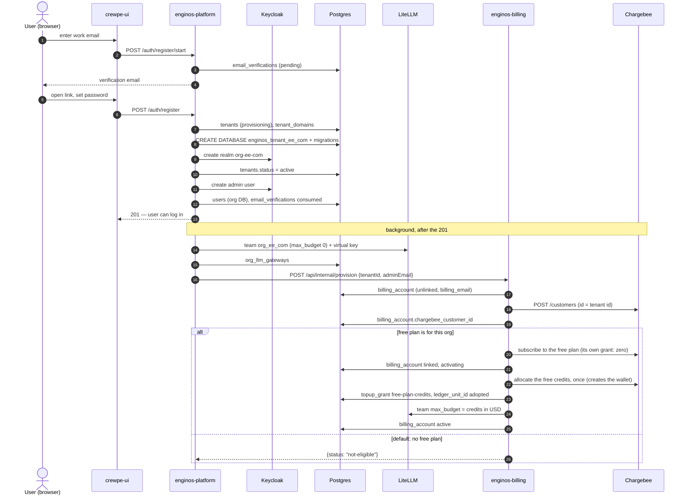

# Org Sign-up — the Full Flow

What happens, system by system, from the moment someone signs up with a new
company email until their org can use AI features. It covers the UI
(crewpe-ui), enginos-platform, enginos-billing, Chargebee, the LiteLLM gateway,
and every database written along the way.

The running example is a new user `admin@ee.com` creating the org **Ee**.

| Name used below | For Ee |
| --- | --- |
| Tenant id | a UUID, e.g. `691d4664-…` — also the Chargebee customer id |
| Keycloak realm | `org-ee-com` |
| Org database | `enginos_tenant_ee_com` |
| Routing slug = LiteLLM team id | `org_ee_com` |
| ClickHouse database | `tenant_org_ee_com` |

---

## Contents

1. [The short version](#1-the-short-version)
2. [Sequence at a glance](#2-sequence-at-a-glance)
3. [Phase 1 — Verify the email](#3-phase-1--verify-the-email)
4. [Phase 2 — Register (the user waits)](#4-phase-2--register-the-user-waits)
5. [Phase 3 — Background provisioning](#5-phase-3--background-provisioning)
6. [Phase 4 — Billing at onboarding](#6-phase-4--billing-at-onboarding)
7. [Phase 5 — The org right after sign-up](#7-phase-5--the-org-right-after-sign-up)
8. [Phase 6 — AI calls and the gateway gate](#8-phase-6--ai-calls-and-the-gateway-gate)
9. [Phase 7 — Choosing and paying for a plan](#9-phase-7--choosing-and-paying-for-a-plan)
10. [Operator controls](#10-operator-controls)
11. [Everything that gets written](#11-everything-that-gets-written)
12. [When something fails](#12-when-something-fails)
13. [Known gaps](#13-known-gaps)

---

## 1. The short version

1. The user proves they own the email address.
2. `POST /auth/register` creates the org **synchronously**: its record, its own
   Postgres database, its Keycloak realm and the admin user. The user gets a
   `201` and can log in.
3. Everything else runs **in the background** a few seconds later: ClickHouse,
   agent-core, org research, the LiteLLM team (with a **$0** budget), and then
   billing.
4. Billing creates the org's **Chargebee customer** for every org. It puts the
   org on the **free plan** only when the free plan is for that org — which, by
   default (`FREE_PLAN_DEFAULT=false`), it is not. A free-plan org gets its
   free credits (`FREE_PLAN_CREDITS`) from billing, once, ever.
5. Until the org has a plan, the gateway **refuses its AI calls** with
   `402 — no active plan`.
6. The admin opens Billing, sees **Choose a plan**, pays on Chargebee's
   checkout, and comes back. Billing links the subscription and sets the
   LiteLLM budget; AI calls work.

---

## 2. Sequence at a glance



---

## 3. Phase 1 — Verify the email

| # | Who | What | API |
| --- | --- | --- | --- |
| 1 | UI | The user enters their work email. | `POST /enginos-api/auth/register/start` |
| 2 | Platform | Rejects public email domains. Records a pending verification and emails a link. Throttled to 3 requests a minute; the answer never says whether the address is already signing up. | `POST /api/v1/auth/register/start` → `202 {status: "sent", expiresIn}` |
| 3 | UI | The user opens the link; the page reads what the token is for. | `GET /enginos-api/auth/verification?token=…` |

**Saved:** a row in `email_verifications` (master DB).
**Billing:** not involved.

---

## 4. Phase 2 — Register (the user waits)

The UI calls `POST /enginos-api/auth/register`, which reaches
`POST /api/v1/auth/register` on the platform (`auth.service.ts` `register()`,
throttled to 5 a minute).

| # | Step | Result |
| --- | --- | --- |
| 1 | Check password strength | `400` if weak |
| 2–3 | Take the domain from the email; refuse public domains | `422 PUBLIC_DOMAIN` |
| 3b | The verification token must match this address | checked before anything is created |
| 4 | Find the org that owns the domain | Found → the user **joins** it as a member and nothing below runs. Not found → the org is created (step 5). |
| 5 | **Create the org** — see the table below | |
| 6 | Refuse a suspended org | `403` |
| 7 | Role: `admin` for a new org, or for the first active user of an org | |
| 8 | Create the user in Keycloak and in the org database; mark the verification used | `users` row in `enginos_tenant_ee_com` |
| 9 | Send Keycloak's verify-email mail, if the policy asks for it | best effort |
| — | Answer | `201` — the user can log in |

### Step 5 — creating the org (`tenant-provisioning.service.ts`)

These run **before** the `201`, in order:

| Step | Action | Writes |
| --- | --- | --- |
| 1 | Reserve the org | `tenants` (status `provisioning`), `tenant_domains` — master DB |
| 2 | Create the org's Postgres database | `enginos_tenant_ee_com` |
| 3 | Run the tenant migrations on it | tables in the org DB |
| 4 | Create the Keycloak realm `org-ee-com` (the identity SPI adds its clients, service accounts and policies) | Keycloak |
| 5 | Mark the org active | `tenants.status = active` |

If any of these fail, the platform **rolls back**: deletes the realm, drops
the database, and revokes any LiteLLM team step 6d may have started. The user
sees the error and can try again.

---

## 5. Phase 3 — Background provisioning

Started during step 5, but **not awaited**: the `201` does not wait for them,
and none of them can fail the sign-up.

| Step | Action | Writes | If it fails |
| --- | --- | --- | --- |
| 5b | ClickHouse database and ingest view for the org's usage spans | `tenant_org_ee_com` (ClickHouse) | Logged; spans wait in `otel_landing` until it exists |
| 6 | Event to integration-service to run its own migrations | integration-service | — |
| 6b | Onboard the org into crewpe-agent-core | agent-core | Queued in Redis and retried |
| 6c | Start the **org research** workflow (it uses the LLM) | agent-core | Logged |
| 6d | **LiteLLM gateway** — see below | LiteLLM, `org_llm_gateways` | Logged; a reconcile endpoint retries |
| 6e | **Billing** — see [Phase 4](#6-phase-4--billing-at-onboarding). Runs only after 6d, because billing sets the team's budget | enginos-billing | Logged; checkout creates the customer later |
| 7 | Welcome email to the admin | email | Logged |

### Step 6d — the LiteLLM gateway (`litellm-provisioning.service.ts`)

1. Creates the team **`org_ee_com`** with **`max_budget: 0`** and no reset
   window. The platform never gives a team money to spend; only billing does.
2. Allows the model aliases of the org's **model-access plan** (`free` for a
   new org — the `*_economy` aliases).
3. Mints a virtual key `tenant-org_ee_com-default`, tagged
   `crewpe.tenant_id = org_ee_com`.
4. Saves `org_llm_gateways`: team id, key id, the key sealed in
   `key_secret_ref`, `credential_mode = pooled`, `plan = free`.

> **Two different "plans".** `org_llm_gateways.plan` (and `plan: free` on the
> LiteLLM team) is the platform's **model-access tier** — which models the org
> may call. The **billing plan** is the Chargebee subscription in
> `billing_account`. They are unrelated: an org with no billing plan still has
> model-access plan `free`.

---

## 6. Phase 4 — Billing at onboarding

**Call:** platform → billing, `POST /api/internal/provision`

```json
{ "tenantId": "691d4664-…", "adminEmail": "admin@ee.com" }
```

Billing runs `checkout.provisionFreePlan()`:

| # | Step | Writes / calls |
| --- | --- | --- |
| 1 | Already has a subscription? Then stop: `already-subscribed`. (Only on a repeat.) | — |
| 2 | Create the local account from the platform's own record of the org | `billing_account` row: `tenant_id`, `routing_slug`, `billing_email = admin@ee.com`, status `unlinked` |
| 3 | **Create the Chargebee customer** — id = tenant id, email = admin's, company = org name | Chargebee `POST /customers` |
| 4 | Store it | `billing_account.chargebee_customer_id` |
| 5 | Is the free plan for this org? `billing_account.free_plan`, or `FREE_PLAN_DEFAULT` when that is empty | — |

Step 3 is safe to repeat: the customer id *is* the tenant id, so a second
create is refused by Chargebee as a duplicate and treated as success.

### A — Default: no free plan (`FREE_PLAN_DEFAULT=false`)

Billing stops after step 5 and answers:

```json
{ "status": "not-eligible", "subscriptionId": null, "customerId": "691d4664-…" }
```

The platform logs *"Billing customer created for tenant …; no free plan, it
chooses a paid plan on its billing page"*. The LiteLLM team keeps
`max_budget: 0`.

### B — The free plan is for this org

| # | Step | Writes / calls |
| --- | --- | --- |
| 6 | Check the free plan is configured and on the plan allowlist | `409` if not |
| 7 | Does Chargebee already hold a live subscription for the customer? (a call that died half-way) | Chargebee `GET /subscriptions` |
| 8 | Check the free plan really costs ₹0 | Chargebee `GET /item_prices/{FREE_PLAN_ITEM_PRICE_ID}` |
| 9 | Subscribe — no checkout, no card. Idempotency key `free-plan:<tenant id>` | Chargebee `POST /customers/{id}/subscription_for_items` |
| 10 | Read the credit unit. The plan's own grant is cut to zero, and a zero-grant plan gets **no wallet** from Chargebee (MEASURED 2026-09-30), so there is none yet | Chargebee `GET /ledger_account_balances` |
| 11 | Link it | `billing_account`: subscription id, item price, term dates, status `activating` |
| 12 | Start usage billing **now** | `billing_account.last_processed_ingested_at = now()` |
| 13 | **Grant the free credits — once per org, ever**: `FREE_PLAN_CREDITS` less what the plan's own grant gave (floor 0), into `FREE_PLAN_CREDIT_UNIT`, expiring 10 years out. The allocate creates the wallet, and the account adopts its unit | `topup_grant` row `free-plan-credits`; Chargebee `GET /grant_blocks`, `POST /ledger_operations/allocate` (key `free-plan-credits:<tenant id>`); `billing_account.ledger_unit_id` |
| 14 | Read the usable balance (less any unpaid top-up) and the live grants | Chargebee balance, grant blocks, invoices |
| 15 | Set the team's budget: spend baseline + credits in USD, no reset window, `billing_managed: true`, unblocked | LiteLLM `GET /team/info`, `POST /team/update` |
| 16 | Mark it active | `billing_account.status = active` |

Steps 10–16 are one link (`syncFromChargebee()`), repeated once a second for up
to 10 s until the account has a credit unit; normally the first pass has one.
If the allocate fails, the account is held `activating` with its team blocked,
and the worker's `activatePending` retries every minute — the `topup_grant`
row makes sure it is granted only once.

Answer: `{ "status": "subscribed", "subscriptionId": "AzZiawVWaZHYOOki" }`.

---

## 7. Phase 5 — The org right after sign-up

About 5–15 seconds after the `201`:

| System | A — no free plan (default) | B — free plan |
| --- | --- | --- |
| `tenants` | `active` | `active` |
| Org DB | created, migrated, admin user | same |
| Keycloak | realm + admin user | same |
| `org_llm_gateways` | team `org_ee_com`, pooled, model plan `free` | same |
| LiteLLM team | `max_budget 0`, not blocked | `max_budget` = credits in USD, `billing_managed` |
| `billing_account` | `unlinked`, customer id, billing email | `active`, subscription, credit unit, cursor |
| `topup_grant` | — | `free-plan-credits`, applied |
| Chargebee | customer | customer + free subscription + the free credits (billing's allocate, which made the wallet) |
| AI calls | **refused** — 402 no active plan | allowed |
| Billing page | **Choose a plan** | balance and plan |

---

## 8. Phase 6 — AI calls and the gateway gate

crewpe-agent-core calls LiteLLM (`:4000`) with the **master key**, which skips
all of LiteLLM's own team checks. It names the org in the request body:

```json
{ "model": "…", "messages": [ … ], "metadata": { "crewpe.tenant_id": "org_ee_com" } }
```

The gateway hook `tenant_gate` (release-management `litellm/tenant_gate.py`)
reads that team before the call and applies its rules:

| Team state | Result | Message the org sees |
| --- | --- | --- |
| Blocked by billing, reason `exhausted` | `402` | Your organization's LLM credits are used up. Top up on the Billing page to continue. |
| Blocked by billing, reason `activating` | `402` | Your organization's credits are still being activated. Try again in a minute. |
| Blocked by hand | `402` | Your organization has no active plan… |
| `max_budget` is 0 — **no plan** | `402` | Your organization has no active plan. Choose a plan on the Billing page to use LLM features. |
| Spend has reached `max_budget` | `402` | credits used up |
| Budget left, or no `max_budget` | allowed | — |
| No org named, or the team cannot be read | allowed (fail-open) | — |

---

## 9. Phase 7 — Choosing and paying for a plan

For an org with no free plan (branch A).

### Opening Billing

| # | Who | What | API |
| --- | --- | --- | --- |
| 1 | UI | Loads the page | `GET /enginos-api/billing` |
| 2 | Platform | Checks the login and admin role, adds the tenant id | `GET /api/internal/billing/{tenantId}` |
| 3 | Billing | Finds `billing_account` (created at onboarding; created here, with no Chargebee call, for an org onboarding never reached) | — |
| 4 | Billing | No free plan for the org → does **not** try to subscribe it | — |
| 5 | Billing | Lists `ITEM_PRICE_IDS`, leaving the free plan out; answers `freePlan: false` | Chargebee `GET /item_prices/{id}` (cached) |
| 6 | UI | Shows **Choose a plan**: each plan's name, price and period, with **Subscribe** | — |

### Subscribing

| # | Who | What | API |
| --- | --- | --- | --- |
| 1 | UI | The admin clicks **Subscribe** | `POST /enginos-api/billing/checkout {itemPriceId}` |
| 2 | Platform | Adds the tenant id | `POST /api/internal/checkout` |
| 3 | Billing | Refuses a plan not in `ITEM_PRICE_IDS`, and the free plan for an org it is not for | `400 plan-not-offered` |
| 4 | Billing | Uses the customer from onboarding (creates it if missing) | — |
| 5 | Billing | Creates Chargebee's hosted checkout, returning to `…/organization/billing?from=checkout` | Chargebee `POST /hosted_pages/checkout_new_for_items` |
| 6 | Browser | Goes to Chargebee, the admin pays | — |
| 7 | Chargebee | Creates the subscription and its credits; sends the browser back with `&id=…&state=succeeded` | — |

### Linking — two paths, either is enough

- **Webhook:** Chargebee `subscription_created` → billing
  `POST /api/webhooks/chargebee`, directly — crewpe-ui and the platform are not
  in the path; billing checks Chargebee's Basic-auth credentials itself. The
  plan's `grant_blocks_created` follows, and re-reads the org once its
  subscription is linked.
- **Return:** the page sees `?from=checkout&state=succeeded` and calls
  `POST /enginos-api/billing/sync-subscription` → billing
  `POST /api/internal/sync-subscription`.

Both run `syncFromChargebee()`: the same steps as 10–16 of branch B, less the
free credits (13) — the paid plan's credits come from its own Credit Grant:
link, start the usage cursor, set the LiteLLM budget, `active`. Until one of
them lands, the page shows **Finishing your subscription** (never the plan
list again, so nobody pays twice) and asks again every 5 seconds. Then it shows
the balance and *"You're subscribed"*, and AI calls pass the gate.

### From then on

The usage sync (every minute) bills ClickHouse usage against the credits, by
when each call ended, about 1–2 minutes after it ends; when they run out the
team is blocked and billing holds the org until a top-up. See
[SUBSCRIPTION-FLOW.md](SUBSCRIPTION-FLOW.md) for the subscription in detail,
[BILLING-USER-FLOWS.md](BILLING-USER-FLOWS.md) sections 10–11, and
[BILLING-ARCHITECTURE.md](BILLING-ARCHITECTURE.md).

---

## 10. Operator controls

| Setting (enginos-billing `.env`) | Now | Meaning |
| --- | --- | --- |
| `FREE_PLAN_DEFAULT` | `false` | Whether an org with no setting of its own gets the free plan |
| `FREE_PLAN_ITEM_PRICE_ID` | `pre-paid-test-v1-INR-Yearly` | The free plan. Must cost ₹0; its own Credit Grant is cut to zero (or a single token), so a renewal gives nothing |
| `FREE_PLAN_CREDITS` | e.g. `1000` | The **total** free credits each free-plan org starts with, granted once per org, ever. Empty: off |
| `FREE_PLAN_CREDIT_UNIT` | `token-test` | The credit unit they go into. Required with `FREE_PLAN_CREDITS` — the zero-grant plan has no wallet to take one from |
| `ITEM_PRICE_IDS` | `pre-paid-test-v1-INR-Monthly` | Paid plans on the Billing page, in this order |
| `DEFAULT_ITEM_PRICE_ID` | `pre-paid-test-v1-INR-Monthly` | Plan used when a checkout names none |

**Per org** — operators only, called on billing directly (never through the
platform, or any org admin could give themselves the free plan):

```bash
curl -X POST http://<billing-host>:4300/api/internal/free-plan \
  -H 'content-type: application/json' \
  -d '{"tenantId":"<uuid>","enabled":true}'
```

| Org's state | `enabled: true` | `enabled: false` |
| --- | --- | --- |
| No subscription | Subscribed to the free plan at once | Offered the paid plans |
| On a plan | Unchanged — setting saved | Unchanged — setting saved |
| Cancelled | Stays cancelled | Stays cancelled |

Repeating the call is safe: it never creates a second subscription.

---

## 11. Everything that gets written

| Store | What | When |
| --- | --- | --- |
| Postgres master — `email_verifications` | pending, then used | Phase 1, Phase 2 step 8 |
| Postgres master — `tenants`, `tenant_domains` | the org, its domain | Phase 2 step 5 |
| Postgres — `enginos_tenant_ee_com` | the org's database; `users` | Phase 2 |
| Keycloak | realm `org-ee-com`, admin user | Phase 2 |
| ClickHouse | `tenant_org_ee_com` | 5b (background) |
| LiteLLM (its own database) | team `org_ee_com`, virtual key | 6d (background) |
| Postgres master — `org_llm_gateways` | team, key, model plan | 6d |
| Postgres master — `billing_account` | account, customer id, billing email; plan, unit, cursor once subscribed | 6e; Phase 7 |
| Postgres master — `topup_grant` | `free-plan-credits`: the free credits, granted once | 6e, free plan only |
| Chargebee | customer; subscription and credits once on a plan | 6e; Phase 7 |

`billing_account` lives in the master database beside `tenants`, but belongs to
enginos-billing; the platform never writes it.

---

## 12. When something fails

| Failure | What the user notices | What recovers it |
| --- | --- | --- |
| Postgres / Keycloak during Phase 2 step 5 | Sign-up error | Rolled back; the user tries again |
| ClickHouse | Nothing | Spans buffer; the next provision re-runs it |
| agent-core down | Nothing at first | Queued and retried |
| LiteLLM during 6d | AI features missing | Reconcile endpoint re-provisions the gateway |
| Billing or Chargebee during 6e | Nothing | Checkout creates the customer; with the free plan on, opening Billing retries it |
| Chargebee refuses the free credits' allocate (step 13) | *Activating your credits*; AI paused | Retried every minute (`activatePending`); granted only once |
| Webhook lost after a checkout | *Finishing your subscription* for a moment | The page's own sync; the daily resync |
| LiteLLM during linking | *Activating your credits*; AI paused | Retried every minute until the budget lands |

---

## 13. Known gaps

1. **AI calls before the team exists are let through.** The team is created a
   few seconds after the org (6d). Until then, `tenant_gate` cannot find it and
   fails open. If 6d fails outright, the org has **no limit** until the gateway
   is reconciled.
2. **Org research fails for an org with no plan.** Step 6c starts an LLM
   workflow at sign-up; the gateway refuses it with `402`. Decide whether
   onboarding research should run without a plan.
3. **The per-org free-plan setting cannot be made before sign-up.** There is no
   billing row yet, so at sign-up only `FREE_PLAN_DEFAULT` decides. Turning it
   on afterwards subscribes the org straight away.
4. **Exhaustion is noticed a minute or two late.**
   Master-key calls are never counted in the team's spend, so LiteLLM's own
   budget cannot stop them; the block comes when billing's usage sync — which
   bills a call about 1–2 minutes after it ends (`BILLING_LAG_MS` 60 s, then
   the next minute's pass) — is refused by Chargebee. The overspend
   is held and billed after the next top-up. Per-org virtual keys in
   agent-core would close this.
5. **The gate is not yet part of the gateway's deployment.** `tenant_gate.py`
   was copied into the running local container. It needs a mount wherever the
   LiteLLM service is defined, and a `COPY` in the AWS image.
6. **Orgs created before this change have no Chargebee customer** until they
   check out; they are not backfilled.
7. **A free-plan org cannot upgrade to a paid plan yet.** Checkout creates a new
   subscription beside the free one, and billing keeps using the free one. The
   plan list is only shown to orgs with no plan, so the UI does not reach this.
