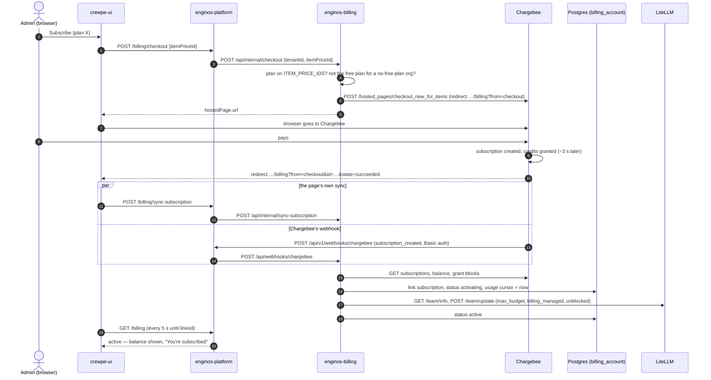

# Subscription Created — the Full Flow

What happens when an org gets a subscription: every way one is created, how
billing finds out, how it is linked to the org, how the org's AI budget is set,
and what every system holds afterwards.

It picks up where [SIGNUP-FLOW.md](SIGNUP-FLOW.md) ends: the org exists, it has
a `billing_account` row and a Chargebee customer, and its LiteLLM team has a $0
budget. The running example is the org **Ee** (tenant id `691d4664-…`, team
`org_ee_com`).

**Money in one line.** `CREDITS_PER_USD=50`: 50 credits buy $1 of AI usage, so
the free plan's 1,000 credits are a $20 budget.

---

## Contents

1. [The short version](#1-the-short-version)
2. [Three ways a subscription is created](#2-three-ways-a-subscription-is-created)
3. [Sequence at a glance](#3-sequence-at-a-glance)
4. [Way 1 — The free plan](#4-way-1--the-free-plan)
5. [Way 2 — A paid plan through checkout](#5-way-2--a-paid-plan-through-checkout)
6. [Way 3 — Created by hand in Chargebee](#6-way-3--created-by-hand-in-chargebee)
7. [How billing finds out](#7-how-billing-finds-out)
8. [Linking and activation — the common path](#8-linking-and-activation--the-common-path)
9. [The org after its subscription is linked](#9-the-org-after-its-subscription-is-linked)
10. [What the admin sees](#10-what-the-admin-sees)
11. [Everything that gets written](#11-everything-that-gets-written)
12. [When something fails](#12-when-something-fails)
13. [Known gaps](#13-known-gaps)

---

## 1. The short version

1. A subscription is created **in Chargebee** — by billing itself (the free
   plan), by the customer paying on Chargebee's checkout (a paid plan), or by
   someone in the Chargebee dashboard.
2. Chargebee issues the plan's **credits** as a grant block, a few seconds
   after the subscription.
3. Billing finds out — from the call it made itself, from Chargebee's webhook,
   from the billing page right after checkout, or from the daily resync. **All
   of them run the same code:** `syncFromChargebee()`.
4. Billing **links** the subscription to the org's `billing_account`, and
   **starts billing usage from now**.
5. Billing sets the org's **LiteLLM budget** to its credits in USD and opens
   the team. The account becomes `active`, and the gateway lets the org's AI
   calls through.

---

## 2. Three ways a subscription is created

| | Way 1 — Free plan | Way 2 — Paid plan | Way 3 — By hand |
| --- | --- | --- | --- |
| **Started by** | Billing — at sign-up, by an operator, or by the billing page | The org's admin, clicking **Subscribe** | Someone in the Chargebee dashboard or API |
| **For** | An org the free plan is for | An org with no plan (the default) | Any org |
| **Card** | None — it costs ₹0 | Entered on Chargebee's page | Whatever they set up |
| **Chargebee call** | `POST /customers/{id}/subscription_for_items` | `POST /hosted_pages/checkout_new_for_items`, then the customer pays | — |
| **Billing finds out from** | Its own call, waiting for the credits | The webhook **and** the page's return | The webhook, or the daily resync |
| **Ready in** | ~3–10 s, inside the request | Seconds after payment | Seconds (webhook) to a day (resync) |

---

## 3. Sequence at a glance

Way 2, the paid plan — the one an org sees by default:



---

## 4. Way 1 — The free plan

Billing creates it in `checkout.provisionFreePlan()`, from three places:

| Caller | When |
| --- | --- |
| enginos-platform, `POST /api/internal/provision` | Sign-up step 6e, if `FREE_PLAN_DEFAULT=true` |
| An operator, `POST /api/internal/free-plan {tenantId, enabled: true}` | When the org has no subscription yet |
| The billing page, on load | For an org the free plan is for, that still has none |

| # | Step | Chargebee / Postgres |
| --- | --- | --- |
| 1 | Stop if the org already has a subscription (live **or cancelled**) | — |
| 2 | Ensure the customer (normally made at sign-up) | `POST /customers` if missing |
| 3 | Stop unless the free plan is for the org | `billing_account.free_plan`, else `FREE_PLAN_DEFAULT` |
| 4 | The free plan must be configured and on the allowlist | `409` otherwise |
| 5 | Link, don't create, if Chargebee already holds a live subscription (a call that died half-way) | `GET /subscriptions` |
| 6 | The plan must cost **₹0** — a card-less customer is never put on a paid plan | `GET /item_prices/{id}` |
| 7 | Create it. Idempotency key `free-plan:<tenant id>` makes concurrent calls create **one** | `POST /customers/{id}/subscription_for_items` |
| 8 | Link it, **waiting for the credits**: `syncFromChargebee()` once a second, up to 10 times, until the credit unit appears | see [section 8](#8-linking-and-activation--the-common-path) |

Chargebee then also sends `subscription_created`; the webhook runs the same
link again and changes nothing.

---

## 5. Way 2 — A paid plan through checkout

### Starting the checkout — `checkout.startSubscription()`

| # | Step | Result |
| --- | --- | --- |
| 1 | UI `POST /enginos-api/billing/checkout {itemPriceId}` → platform adds the tenant from the login → billing `POST /api/internal/checkout` | |
| 2 | The plan must be on `ITEM_PRICE_IDS` — a request cannot name any other price in the catalogue | `400 plan-not-offered` |
| 3 | The free plan is refused for an org it is not for (it costs nothing) | `400 plan-not-offered` |
| 4 | Ensure the customer (normally made at sign-up) | Chargebee `POST /customers` if missing |
| 5 | Create the hosted checkout for that customer and plan, quantity 1, returning to `APP_URL/organization/billing?from=checkout` | Chargebee `POST /hosted_pages/checkout_new_for_items` |
| 6 | The page sends the browser to Chargebee | |

Starting a checkout writes nothing but a missing customer, and nothing happens
if the admin closes Chargebee's page without paying.

### Paying

On Chargebee's page the admin enters a card and pays. Chargebee then:

1. creates the subscription and its first invoice, paid;
2. issues the plan's credits as a **grant block** — about three seconds after
   the subscription, as measured on the free plan;
3. sends the browser back with `&id=<hosted page>&state=succeeded`;
4. sends the `subscription_created` webhook.

Chargebee also sends `payment_succeeded` for the plan's invoice. Billing acts on
`payment_succeeded` only for **top-up** invoices, so this one is ignored.

---

## 6. Way 3 — Created by hand in Chargebee

An operator creates a subscription for the org's customer (customer id = the
tenant id) in the Chargebee dashboard. Billing picks it up from the
`subscription_created` webhook, or at the latest from the next daily resync.
The link is the same as every other way.

A subscription made for a customer that is **not** the tenant id — one Chargebee
generated an id for — is never linked: the webhook is answered `500
unmapped customer` and Chargebee keeps retrying it.

---

## 7. How billing finds out

Four triggers. Each calls `accounts.syncFromChargebee(tenantId)`, which reads
Chargebee **now** and applies what it says — so a delivery that is late,
repeated or out of order ends in the same state.

| Trigger | Path | Notes |
| --- | --- | --- |
| **Billing's own call** | `provisionFreePlan()` → `linkWithLedger()` | Way 1 only. Waits up to 10 s for the credits |
| **Webhook** | Chargebee → platform `POST /api/v1/webhooks/chargebee` → billing `POST /api/webhooks/chargebee` | The platform checks Chargebee's HTTP Basic credentials (Chargebee does not sign webhooks); unset credentials refuse everything. Events that trigger a sync: `subscription_created`, `_activated`, `_changed`, `_renewed`, `_reactivated`, `_resumed`, `_cancelled`, `_deleted`. A failure answers `500`, and Chargebee redelivers. **Cannot reach a developer machine.** |
| **The page's return** | UI sees `?from=checkout&state=succeeded` → `POST /enginos-api/billing/sync-subscription` → billing `POST /api/internal/sync-subscription` | Way 2. Makes the link immediate without waiting for the webhook |
| **Daily resync** | Hatchet `billing-subscription-reconcile`, cron `11 2 * * *` | Every org with a Chargebee customer — every org signed up since customers are made at sign-up; an older org once it has checked out |

---

## 8. Linking and activation — the common path

`account.service.ts`: `syncFromChargebee()` → `syncSubscription()` →
`activate()`.

### 8.1 Which subscription gets the usage

Billing reads the customer's active subscriptions (`GET /subscriptions`, active,
in-trial and non-renewing) and picks one (`models/subscription.ts`):

| Rule | When |
| --- | --- |
| **current** — the one already linked, while still active | Always wins: usage never moves to a new subscription by itself |
| **only** | The customer has exactly one |
| **billing_plan** | The newest one selling a plan on `ITEM_PRICE_IDS` |
| **newest** | None sells a known plan |

More than one active subscription logs `billing.subscription.multiple_active`
with the one chosen. No active subscription, and the linked one has ended, →
the account is cancelled instead.

### 8.2 The steps

| # | Step | Writes |
| --- | --- | --- |
| 1 | Read the credit unit usage will be charged in: the unit already on file for this subscription, or — for a new link — the subscription's **oldest** unit, the plan's. A subscription with several units is logged | Chargebee `GET /ledger_account_balances` |
| 2 | **Coming back from a cancellation?** Restart usage billing at now, so the cancelled period is never charged to the new plan | `last_processed_ingested_at = now()` |
| 3 | Link | `billing_account`: `chargebee_subscription_id`, `chargebee_item_price_id`, `ledger_unit_id`, `current_term_start/end`, status **`activating`** |
| 4 | **Start usage billing** — create-only: the first link sets it to now; a later link never moves it | `last_processed_ingested_at` if empty |
| 5 | Read the usable balance, less any unpaid top-up | Chargebee balance, invoices |
| 6 | **Set the LiteLLM budget** and open the team — one update, see 8.3 | LiteLLM `GET /team/info`, `POST /team/update` |
| 7 | Mark it | **`active`** — or `exhausted` / `activating`, see 8.4 |

A second run of the same link (the webhook after the page's sync) finds
everything already so and changes nothing.

### 8.3 The LiteLLM budget

```
max_budget = spend baseline + (live, paid grant credits ÷ CREDITS_PER_USD)
```

| Field on the team | Set to | Why |
| --- | --- | --- |
| `max_budget` | baseline + credits in USD — Ee's free plan: 0 + 1,000 ÷ 50 = **$20** | The org can spend exactly its credits |
| `budget_duration` | `null` | LiteLLM's own 30-day reset would hand the credits out twice a term |
| `metadata.billing_managed` | `true` | Tells the platform's plan reconciler to leave the budget alone |
| `metadata.billing_spend_baseline` | the team's spend when billing took it over | Earlier (free-tier) spend is not the customer's credits |
| `metadata.billing_baseline_term` | the term start | A renewal moves the baseline once, never twice |
| `blocked` | `false` | Opened in the same update, so it never opens under a stale budget |

### 8.4 How it can end

| Outcome | When | The org |
| --- | --- | --- |
| **`active`** | The budget landed and there are credits | AI calls pass the gateway |
| **`exhausted`** | Chargebee says the usable balance is 0 | Team blocked (`exhausted`); AI refused until a top-up |
| **`activating`** | LiteLLM could not be updated | Team blocked (`activating`); the worker retries every minute (`activatePending`) until it lands |
| stays **`cancelled`** | A cancellation got in while activating | The team is handed back to the platform |

---

## 9. The org after its subscription is linked

| System | Holds |
| --- | --- |
| Chargebee | Subscription, its term, the plan's grant block (credits), the paid invoice (Way 2) |
| `billing_account` | `active`, subscription, item price, credit unit, term, usage cursor = link time |
| LiteLLM team `org_ee_com` | `max_budget` = credits in USD, no reset, `billing_managed`, unblocked |
| Gateway gate | Allows the org's AI calls |
| `chargebee_sync` | Nothing yet — the first row appears when there is usage to bill |

From the next minute the usage sync (Hatchet `billing-usage-sync`) reads the
org's usage from ClickHouse since the cursor and captures it against the
credits. See [BILLING-ARCHITECTURE.md](BILLING-ARCHITECTURE.md).

---

## 10. What the admin sees

| Moment | Billing page |
| --- | --- |
| Before subscribing (no free plan) | **Choose a plan** — each plan's name, price and period, with **Subscribe** |
| Clicked Subscribe | *Opening checkout…*, then Chargebee's page |
| Back from Chargebee, not linked yet | **Finishing your subscription** — never the plan list, so nobody pays twice; asks again every 5 s |
| Linked, budget set | Balance, plan and renewal date, and *"You're subscribed — your plan's credits are ready to use."* |
| Linked, LiteLLM not updated yet | **Activating your credits** — AI paused; the page updates itself |
| A plan refused | *That plan is not available — choose one of the plans listed.* Nothing charged |

---

## 11. Everything that gets written

| Store | What | By |
| --- | --- | --- |
| Chargebee | Subscription; grant block; invoice and payment (Way 2) | Billing (Way 1), the customer (Way 2), an operator (Way 3) |
| Postgres — `billing_account` | subscription, item price, credit unit, term, status, usage cursor | `syncSubscription()` / `activate()` |
| LiteLLM — team | `max_budget`, `budget_duration`, `blocked`, billing metadata | `activate()` → gateway-budget `push()` |
| Logs | `billing.subscription.renewed`, `.multiple_active`, `.multiple_units`, `billing.cursor.restarted`, `billing.budget.push_failed` | as they happen |

---

## 12. When something fails

| Failure | Result | Recovered by |
| --- | --- | --- |
| Chargebee down when checkout starts | `502 checkout-failed`; nothing charged | The admin tries again |
| The admin closes Chargebee's page | No subscription; nothing written | — |
| Webhook lost or delayed | The page's own sync links it | Daily resync |
| The admin closes the tab before returning | The webhook links it | Daily resync |
| LiteLLM down at activation | `activating`, team blocked | `activatePending` every minute |
| Customer id is not the tenant id (Way 3) | Webhook answered `500`, never linked | A person: recreate it for the right customer |
| Free plan misconfigured (Way 1) | `409 free-plan-misconfigured`; no subscription | Fix `FREE_PLAN_ITEM_PRICE_ID` / `ITEM_PRICE_IDS` |

---

## 13. Known gaps

1. **A checkout linked before its credits exist gets a $0 budget.** Only Way 1
   waits for Chargebee's credits. In Way 2, if the page's sync runs before the
   grant block appears (~3 s on the free plan), the account links with no credit unit, goes
   `active` with a $0 LiteLLM budget, and the gateway refuses the org as having
   no plan — until the next sync. In production the webhook usually arrives
   after the credits and repairs it; on a developer machine, which webhooks
   cannot reach, it waits for the daily resync. Fix: make `sync-subscription`
   wait for the credit unit the way `linkWithLedger()` does.
2. **A free-plan org cannot move to a paid plan.** `checkout_new_for_items`
   creates a **second** subscription; the free one is still active, so the
   "current wins" rule keeps billing on it and the paid plan's credits go
   unused. The UI only offers plans to orgs with none, so it cannot start this
   today. Fix: for an org that has a subscription, change its plan
   (`checkout_existing_for_items`) instead of creating another.
3. **A cancelled org is not re-subscribed to the free plan** by
   `/api/internal/free-plan`: its old subscription id is still on the account,
   so it counts as "already subscribed". It has to check out again.
4. **Webhooks do not reach a developer machine**, so locally Way 3 is only
   picked up by the daily resync, or by calling
   `POST /api/internal/sync-subscription {tenantId}` on billing.
